# DevOps Manager Notes

Public executable evidence plane for the **Full Manager MVP Demo**: an Internal AI Platform demo covering Technical Product Manager and DevOps Manager requirements through bounded, exact-subject evidence.

`Product-Manager-Notes` is the public-safe Manager requirement/routing/narrative plane. `skills-shared` owns reusable Tech Lead, Shadow Architect and Git Town procedures. This repository owns public-safe implementation, CI/runtime evidence, ML lifecycle, SLO/policy/supply-chain proof, failure/recovery drills, reviewer convergence and typed Local Handoff contracts.

## Current milestones

```text
M1 CORE_REMOTE_FIRST_GREEN                          PASS_BOUNDED
M2 PUBLIC_REMOTE_FANOUT_FIRST_GREEN                 PASS_BOUNDED
M3 PUBLIC_REMOTE_FAILURE_RECOVERY_FIRST_GREEN       PASS_BOUNDED
M4 PUBLIC_REMOTE_REVIEWER_CONVERGENCE_FIRST_GREEN   PASS_BOUNDED
M5 PUBLIC_LOCAL_KIND_RUNNER_AND_QUEUE_READY          PASS_BOUNDED
M6 PUBLIC_ADVANCED_RUNNER_CONTRACTS_READY            PASS_BOUNDED
```

M6 is **runner-contract readiness**, not physical runtime PASS. Current proof frontier:

```text
remote reviewer convergence                 PASS_BOUNDED
canonical Local Handoff contract            PASS_BOUNDED
local deterministic reviewer                NOT_EXERCISED
local kind/Kubernetes application smoke     NOT_EXERCISED
Argo controller runtime                     NOT_EXERCISED
Argo CD Application reconciliation          NOT_EXERCISED
live Argo Rollouts/Prometheus canary         NOT_EXERCISED
Qwen / llama.cpp local inference            NOT_EXERCISED
1,000-VU synthetic capacity                 NOT_EXERCISED
registry-stored image signing               NOT_EXERCISED
production users/incidents/tenure           OUTSIDE_CURRENT_PROOF
```

Canonical indexes:

```text
docs/milestones/PUBLIC_REMOTE_FANOUT_FIRST_GREEN.md
registry/public-m2-first-green.json

docs/milestones/PUBLIC_REMOTE_FAILURE_RECOVERY_FIRST_GREEN.md
registry/public-m3-failure-recovery.json

docs/milestones/PUBLIC_REMOTE_REVIEWER_CONVERGENCE_FIRST_GREEN.md
registry/public-m4-reviewer-convergence.json

docs/milestones/PUBLIC_M5_LOCAL_KIND_RUNNER_READY.md
registry/public-m5-local-kind-readiness.json

docs/milestones/PUBLIC_M6_ADVANCED_RUNNER_CONTRACTS_READY.md
registry/public-m6-runner-contracts.json

registry/stack-plan.yaml
```

`FIRST_GREEN` is a checkpoint, never production closure.

## Read first

```text
README.md
→ AGENTS.md
→ docs/INDEX.md
→ docs/architecture/FULL_MVP_DEMO.md
→ docs/milestones/PUBLIC_M6_ADVANCED_RUNNER_CONTRACTS_READY.md
→ registry/public-m6-runner-contracts.json
→ registry/stack-plan.yaml
→ handoff/local-handoff-queue.json
→ exact issue / PR / commit / Actions run / artifact / receipt
```

For historical proof, follow M2 → M3 → M4 → M5 indexes from `docs/INDEX.md`.

## Authority boundary

```text
skills-shared
  canonical Tech Lead / Shadow Architect / Git Town methods
       ↓
Product-Manager-Notes
  source / requirement / product decision / gap / routing graph
       ↓ public-safe evidence request
DevOps-Manager-Notes
  app / CI / ML lifecycle / SLO / policy / supply-chain / failure / UI / runtime receipts
       ↓ exact evidence subject
Product-Manager-Notes
  competency closure / interview narrative / portfolio projection
```

GitHub repository metadata is the visibility source of truth. Public reachability does not promote evidence and never authorizes credentials, user/customer private data, employer/client confidential material or redistribution-restricted material. Merge, force-push, release, visibility/permission changes, production promotion/rollback and real-experience claims remain Human-owned.

## Eight-stage execution program

| Stage | Transition | Output |
|---|---|---|
| P0 Subject / authority | `REQUEST_BOUND → SUBJECT_ADMITTED` | exact subject + authority + ceiling |
| P1 Source / evidence | `SUBJECT_ADMITTED → CONTEXT_ADMITTED` | source/claim/evidence/gap graph |
| P2 Problem closure / System Design | `CONTEXT_ADMITTED → SYSTEM_CONTRACT_EXTRACTED` | invariants, State Machines, SLO/failure contracts |
| P3 Technology / ADR | `SYSTEM_CONTRACT_EXTRACTED → ARCHITECTURE_ADMITTED` | selected/rejected stack + license/ops boundaries |
| P4 Tech Lead DAG / Stack | `ARCHITECTURE_ADMITTED → WORKERS_ADMITTED` | dependency DAG + leases + molecular PR plan |
| P5 Implementation | `WORKERS_ADMITTED → FIRST_GREEN` | code/tests/CI/receipt per bounded lane |
| P6 Runtime / failure proof | `FIRST_GREEN → REVERIFIED` | load/fault/recovery/postmortem/re-test |
| P7 Convergence / handoff | `REVERIFIED → DEMO_EVIDENCE_READY` | reviewer packet + Local Handoff residuals |

M2/M3/M4 are remote proof checkpoints. M5 and M6 compile bounded physical-runtime paths while preserving predecessor gates.

## End-to-end State Machine

```text
SOURCE_BOUND
→ BUILD_TESTED
→ SBOM_CREATED
→ SECURITY_POLICY_ADMITTED
→ ARTIFACT_SIGNED
→ MODEL_CONFIG_REGISTERED
→ OFFLINE_EVAL_RUNNING
    ├─ EVAL_REJECTED
    └─ PROMOTION_ELIGIBLE
→ GITOPS_DESIRED_STATE_BOUND
→ CANARY_RUNNING
    ├─ CANARY_REJECTED → ROLLBACK_RUNNING
    └─ PROMOTED
→ OBSERVED
→ LOAD_OR_FAULT_PROBE_RUNNING
→ HEALTHY | DEGRADED
→ INCIDENT_COMMAND_ACTIVE
→ MITIGATING
→ RECOVERED
→ POSTMORTEM_OPEN
→ CORRECTIVE_CHANGE_BOUND
→ SAME_FAILURE_RETEST
→ REVERIFIED
→ REVIEWER_PACKET_ASSEMBLED
→ REMOTE_DEMO_EVIDENCE_READY
→ CANONICAL_LOCAL_HANDOFF_READY
→ LOCAL_REVIEWER_ACTIVE
    ├─ PASS → LIVE_KIND_UNBLOCKED
    └─ FAIL → LOCAL_GAP_OPEN
→ LIVE_KIND_RUNNING
    ├─ PASS → LOCAL_KIND_EVIDENCE_READY
    └─ FAIL → LOCAL_GAP_OPEN
→ ADVANCED_RUNNER_CONTRACTS_READY
→ FUTURE_ADVANCED_QUEUE_EPOCH
→ ARGO | MODEL | 1000_VU | REGISTRY_SIGNING runtime receipts
```

Illegal promotions:

```text
CI_GREEN                → BUSINESS_CORRECT                forbidden
REMOTE_FIRST_GREEN      → PRODUCTION_RUNTIME              forbidden
RUNNER_CONTRACT_PASS    → PHYSICAL_RUNTIME_PASS           forbidden
QUEUE_CONTRACT_PASS     → QUEUE_EXECUTED                  forbidden
LOCAL_REVIEWER_PASS     → LIVE_KIND_PASS                  forbidden
LOCAL_K8S_PASS          → PRODUCTION_INFRA_EXPERIENCE     forbidden
ARGO_CONTROLLERS_PASS   → APPLICATION_RECONCILIATION_PASS forbidden
LOCAL_MODEL_PASS        → PRODUCTION_LLM_TRAFFIC          forbidden
1000_VU_PASS            → 1000_REAL_USERS                 forbidden
LOCAL_SIGNING_PASS      → PRODUCTION_KEY_CUSTODY          forbidden
DRILL_COMPLETE          → PRODUCTION_INCIDENT_HISTORY     forbidden
LICENSE_METADATA_PASS   → BLANKET_LEGAL_CLEARANCE         forbidden
CURRENT_PR_HEAD         → HISTORICAL_ARTIFACT_EVIDENCE   forbidden
```

## Repository topology

```text
DevOps-Manager-Notes/
├── README.md
├── AGENTS.md
├── docs/
│   ├── INDEX.md
│   ├── architecture/
│   ├── evidence-audit/
│   └── milestones/
│       ├── PUBLIC_REMOTE_FANOUT_FIRST_GREEN.md
│       ├── PUBLIC_REMOTE_FAILURE_RECOVERY_FIRST_GREEN.md
│       ├── PUBLIC_REMOTE_REVIEWER_CONVERGENCE_FIRST_GREEN.md
│       ├── PUBLIC_M5_LOCAL_KIND_RUNNER_READY.md
│       └── PUBLIC_M6_ADVANCED_RUNNER_CONTRACTS_READY.md
├── registry/
│   ├── evidence.yaml
│   ├── gaps.yaml
│   ├── mvp-demo-stack.yaml
│   ├── stack-plan.yaml
│   ├── public-m2-first-green.json
│   ├── public-m3-failure-recovery.json
│   ├── public-m4-reviewer-convergence.json
│   ├── public-m5-local-kind-readiness.json
│   └── public-m6-runner-contracts.json
├── platform/
│   ├── app/
│   ├── docker/
│   ├── kubernetes/
│   ├── gitops/
│   ├── rollouts/
│   └── policies/
├── mlops/
├── demo-console/
├── observability/
├── sre/
├── supply-chain/
├── tests/
│   ├── unit/
│   ├── integration/
│   ├── load/
│   ├── failure/scenarios/
│   └── handoff/
├── incidents/
├── runbooks/
├── management/
├── scripts/
│   ├── demo/
│   └── handoff/
│       ├── run_local_reviewer_handoff.py
│       ├── run_live_kind_smoke.py
│       ├── run_live_kind_from_env.sh
│       ├── run_argo_control_plane.py
│       ├── run_argo_control_plane_from_env.sh
│       ├── run_local_model.py
│       ├── run_local_model_from_env.sh
│       ├── run_local_capacity.py
│       ├── run_local_registry_signing.py
│       └── run_local_registry_signing_from_env.sh
├── handoff/local-handoff-queue.json
├── evidence/receipts/
└── .github/workflows/
```

A path exists only when a real artifact was committed. Path presence is not capability proof.

## Directory → State Machine → DAG ownership

| Surface | State responsibility | Owner | Current ceiling |
|---|---|---:|---|
| `system-design/` | requirement → invariant/failure contract | #1 / PR #13 | design/static |
| `platform/app/`, `docker/`, `kubernetes/`, `gitops/` | request → artifact → desired deployment | #2 / PR #14 | remote deterministic/container |
| `observability/`, `sre/`, `tests/load/` | execution → trace/SLI/SLO/load | #3 / PR #36 | remote telemetry + synthetic smoke |
| `platform/policies/` | candidate → admit/reject | #4 / PR #38 | policy/security/license metadata |
| `mlops/`, `platform/rollouts/` | model/prompt/config → eval → canary/rollback contract | #7 / PR #39 | deterministic MLflow lifecycle |
| `demo-console/` | canonical evidence → reviewer UI | #8 / PR #37 | frontend build/render |
| `supply-chain/`, network faults | artifact → SBOM/signature/fault | #10 / PR #40 | same-run signing + bounded drill |
| incident/runbook/management/failure scenarios | failure → authority → recovery → re-test | #5 / PR #42 | deterministic/local-process DRILL |
| `scripts/demo/`, convergence receipts | exact evidence → reviewer packet | #9 / PR #44 | remote reviewer + artifact re-verification |
| canonical `handoff/local-handoff-queue.json` | predecessor → local command → PASS/FAIL receipt | #48 / PR #52 | canonical queue contract only |
| `run_live_kind_*` | isolated kind cluster → immutable app smoke | #47 / PR #51 | runner contract only |
| `run_argo_control_plane*` | local kind context → Argo controllers ready | #54 / PR #55 | runner contract only |
| `run_local_model*` | exact llama/model identity → bounded local inference | #54 / PR #56 | runner contract only |
| `run_local_capacity.py` | loopback app → bounded 1,000-VU experiment | #54 / PR #57 | runner contract only |
| `run_local_registry_signing*` | exact local registry/cosign identity → digest sign/verify | #54 / PR #58 | runner contract only |

## Full data flow

```mermaid
flowchart TD
    S[Job / Article / PDF / Repo / Tech Candidate] --> P[Product Requirement Graph]
    P --> TL[Tech Lead Contract + DAG + Stack]
    TL --> K2[PR #14 Core]
    K2 --> O[PR #36 Observability]
    K2 --> SEC[PR #38 Policy/Security]
    K2 --> ML[PR #39 ML/LLMOps]
    K2 --> UI[PR #37 Demo Console]
    K2 --> SUP[PR #40 Supply/Fault]

    O --> X5[PR #42 Failure/Recovery]
    SEC -. exact evidence .-> X5
    ML -. exact evidence .-> X5
    SUP -. exact evidence .-> X5
    X5 --> X9[PR #44 Reviewer Convergence]
    UI -. exact bytes/artifact .-> X9
    X9 --> RP[Bounded Reviewer Packet]
    RP --> P

    X9 --> D9[PR #45 M4 Local Handoff]
    D9 --> K5[PR #51 Live-kind Runner]
    K5 --> D5[PR #52 Canonical Queue]
    D5 --> LR[M5 Local Reviewer ACTIVE]
    LR -->|PASS receipt| LK[M5 Live Kind]

    ML --> A55[PR #55 Argo Contract]
    ML --> A56[PR #56 Model Contract]
    O --> E57[PR #57 Capacity Contract]
    SUP --> E58[PR #58 Registry Signing Contract]
    A55 --> M6[M6 Contract Index]
    A56 --> M6
    E57 --> M6
    E58 --> M6
    LK -. future PASS .-> AQ[Future Advanced Queue Epoch]
    M6 -. exact runner subjects .-> AQ

    SH[Shadow Architect MONITOR] -. material deltas .-> D5
    SH -.-> A55
    SH -.-> A56
    SH -.-> E57
    SH -.-> E58
```



## Observed molecular Git Town Stack

Machine authority: `registry/stack-plan.yaml`.

```text
C0 PR #6
└─ C11 PR #12
   └─ E1 PR #13
      └─ K2 PR #14 Core
         ├─ A3  PR #36 Observability
         ├─ E4  PR #38 Policy/Security
         ├─ A7  PR #39 ML/LLMOps
         ├─ A8  PR #37 Demo Console
         └─ E10 PR #40 Supply/Fault

PR #36
└─ X5 PR #42 Failure/Recovery
     ↑ exact side evidence #38/#39/#40

PR #42
└─ X9 PR #44 Reviewer Convergence
     ↑ exact Demo Console bytes #37 + M2/M3 artifacts
     └─ D9 PR #45 Local Handoff
          └─ K5 PR #51 Live-kind Runner
               └─ D5 PR #52 Canonical Queue

M6 task fan-out — task siblings, different real Git parents:
PR #39 ├─ A6 PR #55 Argo control-plane contract
       └─ A6 PR #56 local model contract
PR #36 └─ E6 PR #57 1,000-VU capacity contract
PR #40 └─ E6 PR #58 registry-signing contract
```

Task convergence and Git ancestry are distinct graphs. No fake multi-parent Git history is created.

## Canonical Local Handoff

Shadow Architect detected that the first M5 consumer queue had drifted from the portable `skills-shared` schema. The queue was recompiled rather than silently grandfathered.

```text
canonical method:
  ed3c/skills-shared@4ca9417b1da5ff32f1d4d3e7af64a15908749024

PR #52 current head:
  f7a3937d7d0979e3adfaf1ebc4adc0532450d925
  run 32263239722 PASS

queue execution epoch:
  commit 4cc3e162c00a3af240bab9e62482e07bb3e4f9a1
  tree   5ff3349c1eb5c7976263c2e89347a353ccbc1072
```

Current canonical queue:

```text
M5-LOCAL-REVIEWER-001       ACTIVE
M5-LIVE-KIND-002            BLOCKED_BY_PREDECESSOR
M6-ADVANCED-SUBSTRATE-003   BLOCKED_BY_PREDECESSOR
```

Portable queue assertion and its negative-control selftest are part of CI. Queue contract PASS is not queue execution.

## M6 exact contract subjects

| PR | Contract | Head | Run | Contract ceiling | Future real-PASS ceiling |
|---:|---|---|---:|---|---|
| #55 | Argo controllers | `284dbf1d…` | `32265921102` | `GITHUB_HOSTED_ARGO_RUNNER_CONTRACT_ONLY` | `LOCAL_ARGO_CONTROLLERS_READY_ONLY` |
| #56 | llama.cpp/model | `63355992…` | `32265971683` | `GITHUB_HOSTED_LOCAL_MODEL_RUNNER_CONTRACT_ONLY` | `LOCAL_LLAMA_CPP_MODEL_INFERENCE_ONLY` |
| #57 | 1,000 VU | `2240e8ee…` | `32266078175` | `GITHUB_HOSTED_1000_VU_RUNNER_CONTRACT_ONLY` | `LOCAL_SYNTHETIC_1000_VU_ONLY` |
| #58 | registry signing | `1b543fdf…` | `32266026763` | `GITHUB_HOSTED_REGISTRY_SIGNING_RUNNER_CONTRACT_ONLY` | `LOCAL_REGISTRY_STORED_IMAGE_SIGNATURE_ONLY` |

Exact trees, limits, residuals and Shadow deltas are in `registry/public-m6-runner-contracts.json` and `docs/milestones/PUBLIC_M6_ADVANCED_RUNNER_CONTRACTS_READY.md`.

## Selected MVP stack

Machine inventory: `registry/mvp-demo-stack.yaml`.

```text
Python / FastAPI / Pydantic
PostgreSQL / SQLAlchemy / Alembic
React / Vite / TanStack Query / Apache ECharts
MLflow / llama.cpp + separately pinned model artifact
Docker CLI / Moby / kind / Kubernetes
Argo CD / Argo Rollouts
OpenTelemetry / Prometheus / Jaeger
OPA / Trivy / Syft / Cosign
Locust / Toxiproxy / pytest
GitHub Actions
```

Top-level licenses do not recursively clear transitive packages, images, plugins, model weights, downloaded binaries, Actions or SaaS terms.

## Evidence ladder

```text
L0 SOURCE_CLAIM
L1 STATIC_REASONING
L2 DETERMINISTIC_TEST
L3 LOCAL_INTEGRATION
L4 REAL_SUBSTRATE
L5 ADVERSARIAL_OR_CHAOS
L6 PRODUCTION_OBSERVATION
```

States:

```text
PASS
FAIL
ABSENT
NOT_IMPLEMENTED
NOT_EXERCISED
SKIPPED_BY_POLICY
HUMAN_ADMIT_REQUIRED
```

Lower evidence never self-promotes.

## Next legal frontier

```text
M6 advanced runner-contract readiness  PASS_BOUNDED
        ↓
M5-LOCAL-REVIEWER-001                  requires real local PASS receipt
        ↓
M5-LIVE-KIND-002                       requires real local PASS receipt
        ↓
compile next canonical queue epoch using exact PR #55/#56/#57/#58 runner subjects
        ↓
Argo / model / 1000-VU / registry-signing physical receipts
```

The public GitHub implementation work for this checkpoint is stage-complete. Further capability promotion requires exact Local Handoff receipts; README, issue state, CI, runner contracts and queue contracts cannot substitute for physical execution.
