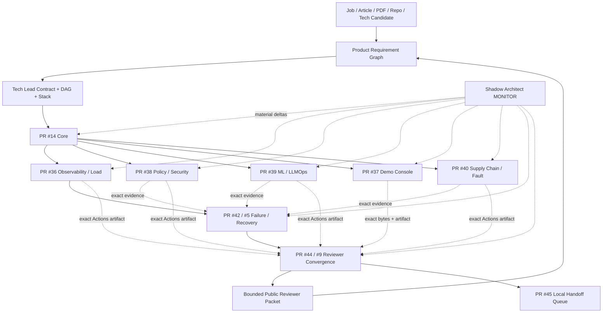

# DevOps Manager Notes

Public executable evidence plane for the **Full Manager MVP Demo**: an Internal AI Platform demo that covers Technical Product Manager and DevOps Manager role requirements through explicit, bounded evidence.

`Product-Manager-Notes` is the public-safe management/routing center. `skills-shared` owns reusable Tech Lead, Shadow Architect and Git Town procedures. This repository owns public-safe implementation, CI/runtime evidence, ML lifecycle, SLO/policy/supply-chain evidence, failure/recovery drills, the recruiter-facing Demo Console and exact receipts.

## Current milestones

```text
M1 CORE_REMOTE_FIRST_GREEN                       = PASS_BOUNDED
M2 PUBLIC_REMOTE_FANOUT_FIRST_GREEN              = PASS_BOUNDED
M3 PUBLIC_REMOTE_FAILURE_RECOVERY_FIRST_GREEN    = PASS_BOUNDED
M4 PUBLIC_REMOTE_REVIEWER_CONVERGENCE_FIRST_GREEN = PASS_BOUNDED
```

Canonical milestone indexes:

```text
docs/milestones/PUBLIC_REMOTE_FANOUT_FIRST_GREEN.md
registry/public-m2-first-green.json

docs/milestones/PUBLIC_REMOTE_FAILURE_RECOVERY_FIRST_GREEN.md
registry/public-m3-failure-recovery.json

docs/milestones/PUBLIC_REMOTE_REVIEWER_CONVERGENCE_FIRST_GREEN.md
registry/public-m4-reviewer-convergence.json

registry/stack-plan.yaml
```

M4 means the public MVP is **reviewer-demo-ready at the remote GitHub evidence ceiling**. It does not mean production-ready. Live kind/Kubernetes, real Argo CD reconciliation, live Argo Rollouts/Prometheus canary, local Qwen/llama.cpp, 1,000-VU capacity/recovery, production users/incidents and real people-management tenure remain outside the current proof ceiling.

`FIRST_GREEN` is a checkpoint, never terminal production closure.

## Read first

```text
README.md
→ AGENTS.md
→ docs/INDEX.md
→ docs/architecture/FULL_MVP_DEMO.md
→ docs/milestones/PUBLIC_REMOTE_FANOUT_FIRST_GREEN.md
→ docs/milestones/PUBLIC_REMOTE_FAILURE_RECOVERY_FIRST_GREEN.md
→ docs/milestones/PUBLIC_REMOTE_REVIEWER_CONVERGENCE_FIRST_GREEN.md
→ registry/mvp-demo-stack.yaml
→ registry/stack-plan.yaml
→ registry/public-m2-first-green.json
→ registry/public-m3-failure-recovery.json
→ registry/public-m4-reviewer-convergence.json
→ prompts/README.md
→ exact issue / PR / commit / Local Handoff / receipt
```

## Authority boundary

```text
skills-shared
  Tech Lead / Shadow Architect / Git Town methods
       ↓ method dependency
Product-Manager-Notes
  source / requirement / product decision / gap / routing graph
       ↓ public-safe evidence request
DevOps-Manager-Notes
  app / CI / ML lifecycle / SLO / policy / supply-chain / failure / UI / receipts
       ↓ exact evidence subject
Product-Manager-Notes
  competency closure / interview narrative / portfolio projection
```

GitHub repository metadata is the visibility source of truth. Public reachability does not promote evidence and does not authorize credentials, customer/user private data, employer/client confidential material, private source bodies or redistribution-restricted material. Merge, release, repository visibility/permissions, production promotion/rollback and real-experience claims remain Human-owned.

## Eight-stage execution program

| Stage | Transition | Output |
|---|---|---|
| P0 Subject / authority | `REQUEST_BOUND → SUBJECT_ADMITTED` | exact repo/branch/commit/issue + authority + evidence ceiling |
| P1 Source / evidence | `SUBJECT_ADMITTED → CONTEXT_ADMITTED` | source/claim/evidence/gap graph |
| P2 Problem closure / System Design | `CONTEXT_ADMITTED → SYSTEM_CONTRACT_EXTRACTED` | invariants, state machines, SLO/failure contract |
| P3 Technology / ADR | `SYSTEM_CONTRACT_EXTRACTED → ARCHITECTURE_ADMITTED` | selected/rejected stack + license/ops boundaries |
| P4 Tech Lead DAG / Stack | `ARCHITECTURE_ADMITTED → WORKERS_ADMITTED` | real dependency DAG + leases + molecular PR plan |
| P5 Implementation | `WORKERS_ADMITTED → FIRST_GREEN` | code/tests/CI/receipt per bounded lane |
| P6 Runtime / failure proof | `FIRST_GREEN → REVERIFIED` | load/fault/recovery/postmortem/same-failure re-test |
| P7 Convergence / export / handoff | `REVERIFIED → DEMO_EVIDENCE_READY` | reviewer packet + public evidence index + Local Handoff residuals |

M2 is the remote fan-out checkpoint, M3 is the remote failure/recovery checkpoint, and M4 is the remote reviewer-convergence checkpoint. None skips Local Handoff for evidence that requires a physical/local substrate.

## End-to-end state machine

```text
SOURCE_BOUND
→ BUILD_TESTED
→ SBOM_CREATED
→ SECURITY_POLICY_ADMITTED
→ ARTIFACT_SIGNED
→ MODEL_CONFIG_REGISTERED
→ OFFLINE_EVAL_RUNNING
    ├─ EVAL_REJECTED
    └─ PROMOTION_ELIGIBLE
→ GITOPS_DESIRED_STATE_BOUND
→ CANARY_RUNNING
    ├─ CANARY_REJECTED → ROLLBACK_RUNNING
    └─ PROMOTED
→ OBSERVED
→ LOAD_OR_FAULT_PROBE_RUNNING
→ HEALTHY | DEGRADED
→ INCIDENT_COMMAND_ACTIVE
→ MITIGATING
→ RECOVERED
→ POSTMORTEM_OPEN
→ CORRECTIVE_CHANGE_BOUND
→ SAME_FAILURE_RETEST
→ REVERIFIED
→ REVIEWER_INPUTS_BOUND
→ ARTIFACTS_REDOWNLOADED
→ ARTIFACT_DIGESTS_VERIFIED
→ REVIEWER_PACKET_ASSEMBLED
→ DEMO_EVIDENCE_READY
```

Illegal promotions:

```text
CI_GREEN               → BUSINESS_CORRECT              forbidden
REMOTE_FIRST_GREEN     → PRODUCTION_RUNTIME            forbidden
LOCAL_K8S_PASS         → PRODUCTION_INFRA_EXPERIENCE   forbidden
1000_VU_PASS           → 1000_REAL_USERS               forbidden
DRILL_COMPLETE         → PRODUCTION_INCIDENT_HISTORY   forbidden
LICENSE_METADATA_PASS  → BLANKET_LEGAL_CLEARANCE       forbidden
UI_GREEN               → BACKEND_EVIDENCE_PASS         forbidden
ISSUE_CLOSED           → RUNTIME_CLOSED                forbidden
CURRENT_PR_HEAD         → HISTORICAL_ARTIFACT_EVIDENCE forbidden
QUEUE_EXISTS            → LOCAL_EXECUTION_PASS         forbidden
```

## Repository topology

```text
DevOps-Manager-Notes/
├── README.md
├── AGENTS.md
├── LICENSE
├── docs/
│   ├── INDEX.md
│   ├── architecture/
│   ├── evidence-audit/
│   └── milestones/
│       ├── PUBLIC_REMOTE_FANOUT_FIRST_GREEN.md
│       ├── PUBLIC_REMOTE_FAILURE_RECOVERY_FIRST_GREEN.md
│       └── PUBLIC_REMOTE_REVIEWER_CONVERGENCE_FIRST_GREEN.md
├── registry/
│   ├── evidence.yaml
│   ├── gaps.yaml
│   ├── technology-candidates.yaml
│   ├── mvp-demo-stack.yaml
│   ├── stack-plan.yaml
│   ├── public-m2-first-green.json
│   ├── public-m3-failure-recovery.json
│   └── public-m4-reviewer-convergence.json
├── system-design/
├── platform/
│   ├── app/
│   ├── docker/
│   ├── kubernetes/
│   ├── gitops/
│   ├── rollouts/
│   └── policies/
├── mlops/
├── demo-console/
├── observability/
├── sre/
├── supply-chain/
├── tests/
│   ├── unit/
│   ├── integration/
│   ├── e2e/
│   ├── load/
│   └── failure/scenarios/
├── incidents/
├── runbooks/
├── management/
├── prompts/
├── scripts/
│   ├── demo/
│   └── handoff/
├── handoff/local-handoff-queue.json
├── evidence/receipts/
└── .github/workflows/
```

Directories are introduced only with real artifacts. Path presence is not capability proof.

## Directory → State Machine → DAG ownership

| Surface | State responsibility | Owner | Current evidence ceiling |
|---|---|---:|---|
| `system-design/` | requirement → invariant/failure contract | #1 / PR #13 | design/static |
| `platform/app/`, `docker/`, `kubernetes/`, `gitops/` | request → artifact → desired deployment | #2 / PR #14 | GitHub-hosted deterministic/container; live K8s separate |
| `observability/`, `sre/`, `tests/load/` | execution → trace/SLI/SLO/load | #3 / PR #36 | remote telemetry + synthetic smoke |
| `platform/policies/` | candidate → admit/reject | #4 / PR #38 | policy/security/license metadata |
| `mlops/`, `platform/rollouts/` | model/prompt/config → eval → canary/rollback contract | #7 / PR #39 | deterministic MLflow lifecycle |
| `demo-console/` | canonical public evidence → reviewer UI | #8 / PR #37 | frontend build/render |
| `supply-chain/`, network fault tests | artifact → SBOM/signature/fault drill | #10 / PR #40 | same-run signing + bounded drill |
| `incidents/`, `runbooks/`, `management/`, failure scenarios | failure → detection → authority → recovery → re-test | #5 / PR #42 | deterministic/local-process DRILL |
| `scripts/demo/`, convergence receipts | exact evidence → reviewer path | #9 / PR #44 | remote reviewer convergence + artifact re-verification |
| `handoff/local-handoff-queue.json` | remote boundary → local command → receipt | #9 / PR #45 | queue contract until executed |

## Full data flow



## Observed molecular Git Town Stack

Canonical machine plan: `registry/stack-plan.yaml`.

```text
C0    PR #6   bootstrap                                      ROOT
└─ C11 PR #12 Full MVP technology/architecture              TRUE_CHILD
   └─ E1  PR #13 evidence audit + invariant freeze          TRUE_CHILD
      └─ K2  PR #14 Core remote FIRST_GREEN                 TRUE_CHILD
         ├─ A3  PR #36 #3 observability/load                SIBLING
         ├─ E4  PR #38 #4 policy/security/license           SIBLING
         ├─ A7  PR #39 #7 ML/LLMOps                         SIBLING
         ├─ A8  PR #37 #8 Demo Console                      SIBLING
         └─ E10 PR #40 #10 supply-chain/fault               SIBLING

A3 PR #36
└─ X5 PR #42 #5 failure/recovery                            TRUE_CHILD + CONVERGENCE
     ↑ exact evidence from PR #38 / #39 / #40

X5 PR #42
└─ X9 PR #44 #9 reviewer convergence                        TRUE_CHILD + CONVERGENCE
     ↑ exact Demo Console bytes from PR #37
     ↑ exact M2/M3 Actions artifacts
     └─ D9 PR #45 Local Handoff Queue                       TRUE_CHILD / LOCAL_HANDOFF
```

Task convergence and Git ancestry are deliberately separate. X5/X9 have one Git parent each and consume remaining prerequisites as typed side inputs.

## Exact M4 remote receipts

### Deterministic reviewer replay

```text
PR / source      #44 / 55d18cdc556ca5d66c67406318ae25196c077fd2
workflow         Full MVP reviewer convergence
run              32256802856
artifact         9366615717
digest           sha256:e652cdf3ccb8de7a8655f9148bc6471a29bcaeaef2d55f6255bca2cb2b1e19d3
size             1,394,198 bytes
ceiling          GITHUB_HOSTED_REMOTE_REVIEWER_CONVERGENCE_ONLY
```

### Exact Actions artifact re-verification

```text
PR / source      #44 / 55d18cdc556ca5d66c67406318ae25196c077fd2
workflow         Full MVP public reviewer convergence
run              32256802554
artifact         9366596481
digest           sha256:696f56be2fb637e386941eb313caa7c9448900ad0bad88b3a96119b95315596c
size             2,841,522 bytes
ceiling          GITHUB_HOSTED_ARTIFACT_REDOWNLOAD_AND_REVIEWER_BUNDLE_ONLY
```

The second workflow re-downloads all six bound M2/M3 Actions archives, verifies their GitHub-published SHA-256 digests and admits only required public-safe files before building the final static reviewer packet.

## Shadow Architect M4 review

Material corrections at the reviewer boundary:

- `EVIDENCE_DELTA`: current PR heads are now separated from historical artifact evidence heads. PR #42 current head and M3 evidence head are intentionally different subjects.
- `DAG/EVIDENCE_DELTA`: Demo Console byte consumption is CI-verified against exact PR #37 evidence head rather than trusted by prose.
- `EVIDENCE_DELTA`: six prerequisite Actions artifacts are independently re-downloaded and SHA-256 verified before admission.
- `RESOURCE_DELTA`: both reviewer artifacts stay below the 5 MB public packet budget.
- `OWNERSHIP_DELTA`: two #9 workflows remain only because one proves fresh deterministic replay while the other proves historical artifact readback/re-verification.

No L3 blocker remains for **remote M4**. The remaining blockers require Local Handoff or Human Admit.

## Local Handoff Execution Queue

PR #45 binds the exact hardened M4 subject:

```text
commit 55d18cdc556ca5d66c67406318ae25196c077fd2
tree   a4ad37d9baf73a5239f79c516c67b0182420336a
```

ACTIVE item:

```bash
bash scripts/demo/run_reviewer_demo.sh evidence/local-reviewer
```

Expected receipt:

```text
evidence/local-reviewer/reviewer-demo-receipt.json
```

Evidence ceiling: `LOCAL_DETERMINISTIC_REVIEWER_RUN_ONLY`.

The next live-substrate queue item remains `BLOCKED_UNRESOLVED`; no kind/Kubernetes, Argo, model or 1,000-VU command is fabricated until a bounded committed runner, exact artifacts, resource budget and cleanup contract exist.

## Selected MVP stack

Machine inventory: `registry/mvp-demo-stack.yaml`.

```text
Python / FastAPI / Pydantic
PostgreSQL / SQLAlchemy / Alembic
React / Vite / TanStack Query / Apache ECharts
MLflow / llama.cpp + separately pinned model artifact
Docker CLI / Moby / kind / Kubernetes
Argo CD / Argo Rollouts
OpenTelemetry / Prometheus / Jaeger
OPA / Trivy / Syft / Cosign
Locust / Toxiproxy / pytest
GitHub Actions
```

Top-level permissive licenses do not recursively clear transitive packages, images, plugins, model weights, downloaded binaries, Actions or SaaS terms.

## Evidence ladder

```text
L0 SOURCE_CLAIM
L1 STATIC_REASONING
L2 DETERMINISTIC_TEST
L3 LOCAL_INTEGRATION
L4 REAL_SUBSTRATE
L5 ADVERSARIAL_OR_CHAOS
L6 PRODUCTION_OBSERVATION
```

Evidence states:

```text
PASS
FAIL
ABSENT
NOT_IMPLEMENTED
NOT_EXERCISED
SKIPPED_BY_POLICY
HUMAN_ADMIT_REQUIRED
```

Lower evidence never self-promotes.

## Next legal frontier

```text
M4 remote reviewer packet = PASS_BOUNDED
        ↓
PR #45 Local Handoff
        ├─ local deterministic reviewer receipt
        └─ live-substrate runner compilation only when concrete
                ↓
optional higher-substrate evidence
        +
Product-Manager-Notes interview/public-portfolio convergence
```

The remote public engineering MVP is now stage-complete at the M4 evidence ceiling. Further capability promotion requires exact Local Handoff/runtime receipts or Human-owned evidence; it cannot be created by README, issue or UI state.
