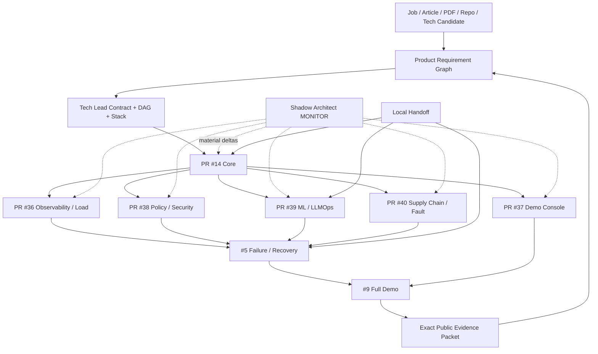

# DevOps Manager Notes

Public executable evidence plane for the **Full Manager MVP Demo**: one Internal AI Platform demo that covers the technical requirements of the Technical Product Manager and DevOps Manager target roles through explicit, bounded evidence.

`Product-Manager-Notes` is the public-safe management/routing center. `skills-shared` owns reusable Tech Lead, Shadow Architect and Git Town methods. This repository owns public-safe implementation, CI/runtime evidence, failure/recovery exercises, the recruiter-facing Demo Console and exact receipts.

## Current milestone

```text
M2 PUBLIC_REMOTE_FANOUT_FIRST_GREEN = PASS_BOUNDED
```

Exact milestone index:

- `docs/milestones/PUBLIC_REMOTE_FANOUT_FIRST_GREEN.md`
- `registry/public-m2-first-green.json`
- `registry/stack-plan.yaml`

What is already exercised remotely: Core Python/PostgreSQL/container path, observability/load smoke, policy/security gates, deterministic MLflow lifecycle, Demo Console build, SBOM/signature mismatch control and bounded Toxiproxy fault drill.

What remains outside this milestone: live kind/Kubernetes, real Argo reconciliation, 1,000-VU capacity run, local Qwen/llama.cpp, live Argo Rollouts/Prometheus canary, full #5 failure/recovery convergence, #9 one-command reviewer convergence, real users/incidents/production/management tenure.

`FIRST_GREEN` is a checkpoint, never terminal closure.

## Read first

```text
README.md
→ AGENTS.md
→ docs/INDEX.md
→ docs/architecture/FULL_MVP_DEMO.md
→ docs/milestones/PUBLIC_REMOTE_FANOUT_FIRST_GREEN.md
→ registry/mvp-demo-stack.yaml
→ registry/stack-plan.yaml
→ registry/public-m2-first-green.json
→ prompts/README.md
→ exact issue / PR / commit / Local Handoff / receipt
```

## Authority boundary

```text
skills-shared
  reusable Tech Lead / Shadow Architect / Git Town methods
       ↓ method dependency
Product-Manager-Notes
  public-safe source / requirement / product decision / routing graph
       ↓ public-safe evidence request
DevOps-Manager-Notes
  executable app / CI / ML lifecycle / SLO / policy / fault / UI / receipts
       ↓ exact evidence subjects
Product-Manager-Notes
  competency closure / interview narrative
```

GitHub repository metadata is the visibility source of truth. Both Manager repositories are currently observed as public. Public reachability does not promote evidence and never authorizes committing credentials, customer/user private data, employer/client confidential material, private source bodies or restricted redistribution material. Repository visibility and permission changes remain Human-owned.

## Eight-stage execution program

| Stage | Transition | Output |
|---|---|---|
| P0 Subject / authority | `REQUEST_BOUND → SUBJECT_ADMITTED` | exact repo/branch/commit/issue, authority, evidence ceiling |
| P1 Source / evidence | `SUBJECT_ADMITTED → CONTEXT_ADMITTED` | source/claim/evidence/gap graph |
| P2 Problem closure / System Design | `CONTEXT_ADMITTED → SYSTEM_CONTRACT_EXTRACTED` | invariants, state machines, SLO/failure contract |
| P3 Technology / ADR | `SYSTEM_CONTRACT_EXTRACTED → ARCHITECTURE_ADMITTED` | selected/rejected stack and license/ops boundaries |
| P4 Tech Lead DAG / Stack | `ARCHITECTURE_ADMITTED → WORKERS_ADMITTED` | real dependency DAG, path leases, molecular PR plan |
| P5 Implementation | `WORKERS_ADMITTED → FIRST_GREEN` | code/tests/CI/receipt per bounded lane |
| P6 Runtime / failure proof | `FIRST_GREEN → REVERIFIED` | load/fault/rollback/postmortem/same-failure re-test |
| P7 Convergence / export / handoff | `REVERIFIED → DEMO_EVIDENCE_READY` | reviewer path, public evidence packet, Local Handoff residuals |

M2 is a P5/P6 remote checkpoint. It does not skip Local Handoff or #5/#9 convergence.

## End-to-end state machine

```text
SOURCE_BOUND
→ BUILD_TESTED
→ SBOM_CREATED
→ SECURITY_POLICY_ADMITTED
→ ARTIFACT_SIGNED
→ MODEL_CONFIG_REGISTERED
→ OFFLINE_EVAL_RUNNING
    ├─ EVAL_REJECTED
    └─ PROMOTION_ELIGIBLE
→ GITOPS_DESIRED_STATE_BOUND
→ CANARY_RUNNING
    ├─ CANARY_REJECTED → ROLLBACK_RUNNING
    └─ PROMOTED
→ OBSERVED
→ LOAD_OR_FAULT_PROBE_RUNNING
→ HEALTHY | DEGRADED
→ MITIGATING
→ RECOVERED
→ POSTMORTEM_OPEN
→ CORRECTIVE_CHANGE_BOUND
→ SAME_FAILURE_RETEST
→ REVERIFIED
→ DEMO_EVIDENCE_READY
```

Illegal promotions:

```text
CI_GREEN               → BUSINESS_CORRECT              forbidden
REMOTE_FIRST_GREEN     → PRODUCTION_RUNTIME            forbidden
LOCAL_K8S_PASS         → PRODUCTION_INFRA_EXPERIENCE   forbidden
1000_VU_PASS           → 1000_REAL_USERS               forbidden
DRILL_COMPLETE         → PRODUCTION_INCIDENT_HISTORY   forbidden
LICENSE_METADATA_PASS  → BLANKET_LEGAL_CLEARANCE       forbidden
UI_GREEN               → BACKEND_EVIDENCE_PASS         forbidden
ISSUE_CLOSED           → RUNTIME_CLOSED                forbidden
```

## Repository topology

```text
DevOps-Manager-Notes/
├── README.md
├── AGENTS.md
├── LICENSE
├── docs/
│   ├── INDEX.md
│   ├── architecture/
│   │   ├── DELIVERY_RELIABILITY_LAB.md
│   │   └── FULL_MVP_DEMO.md
│   ├── evidence-audit/
│   └── milestones/
│       └── PUBLIC_REMOTE_FANOUT_FIRST_GREEN.md
├── registry/
│   ├── evidence.yaml
│   ├── gaps.yaml
│   ├── technology-candidates.yaml
│   ├── mvp-demo-stack.yaml
│   ├── stack-plan.yaml
│   └── public-m2-first-green.json
├── system-design/
├── platform/
│   ├── app/
│   ├── docker/
│   ├── kubernetes/
│   ├── gitops/
│   ├── rollouts/
│   └── policies/
├── mlops/
├── demo-console/
├── observability/
├── sre/
├── supply-chain/
├── tests/
│   ├── unit/
│   ├── integration/
│   ├── e2e/
│   ├── load/
│   └── failure/
├── incidents/
├── runbooks/
├── management/
├── prompts/
├── scripts/
│   ├── demo/
│   └── handoff/
├── handoff/
│   └── local-handoff-queue.json
├── evidence/receipts/
└── .github/workflows/
```

Directories are created only with real artifacts. Path presence is not capability proof.

## Directory → State Machine → DAG ownership

| Surface | State responsibility | Current owner | Evidence ceiling |
|---|---|---:|---|
| `system-design/` | requirement → invariant/failure contract | #1 / PR #13 | design/static |
| `platform/app/`, `docker/`, `kubernetes/`, `gitops/` | request → artifact → desired deployment | #2 / PR #14 | GitHub-hosted deterministic/container; live K8s separate |
| `observability/`, `sre/`, `tests/load/` | execution → trace/SLI/SLO/load | #3 / PR #36 | remote telemetry + synthetic smoke only |
| `platform/policies/` | candidate → admit/reject | #4 / PR #38 | policy/security/license metadata only |
| `mlops/`, `platform/rollouts/` | model/prompt/config → eval → canary/rollback contract | #7 / PR #39 | deterministic MLflow lifecycle only |
| `demo-console/` | canonical public evidence → reviewer UI | #8 / PR #37 | frontend build/render only |
| `supply-chain/`, network failure tests | artifact → SBOM/signature/fault drill | #10 / PR #40 | same-run signing + bounded drill only |
| `incidents/`, `runbooks/`, `management/` | failure → decision → recovery → corrective action | #5 | NOT_IMPLEMENTED |
| `scripts/demo/`, convergence receipts | admitted evidence → reviewer path | #9 | NOT_IMPLEMENTED |
| `handoff/local-handoff-queue.json` | remote boundary → local command → receipt | #2 then runtime lanes | queue contract until executed |

## Full data flow



## Observed molecular Git Town Stack

Canonical machine plan: `registry/stack-plan.yaml`.

```text
C0   PR #6   bootstrap                                        ROOT
└─ C11 PR #12 Full MVP technology/architecture                TRUE_CHILD
   └─ E1 PR #13 evidence audit + invariant freeze             TRUE_CHILD
      └─ K2 PR #14 Core remote FIRST_GREEN                    TRUE_CHILD
         ├─ A3  PR #36 #3 observability/load                  SIBLING
         ├─ E4  PR #38 #4 policy/security/license             SIBLING
         ├─ A7  PR #39 #7 ML/LLMOps                           SIBLING
         ├─ A8  PR #37 #8 Demo Console                        SIBLING
         └─ E10 PR #40 #10 supply-chain/fault                 SIBLING
                 └──── exact verified side-inputs ─────┐
                                                       ▼
                       X5 #5 failure/recovery           CONVERGENCE
                                                       │
                                           + A8 receipt│
                                                       ▼
                       X9 #9 final reviewer demo        CONVERGENCE
```

A multi-input convergence never invents multiple Git parents. One convergence owner chooses a stable admitted base and consumes the remaining prerequisites through exact receipt subjects.

## M2 exact remote receipts

| PR | Lane | Run | Artifact digest | Status |
|---:|---|---:|---|---|
| #36 | observability/load | `32249524958` | `sha256:de464ff881638a42f9bf536ff7ba6e255d1e419647ce1522002fdbaac4201430` | `PASS_BOUNDED` |
| #38 | policy/security | `32251169964` | `sha256:68ac7b4ce0b7bfc2535c54b1960d3b56152fd4947bf031c56c00eb5f7f5f7b4b` | `PASS_BOUNDED` |
| #39 | ML/LLMOps | `32250421421` | `sha256:ba3a173b4d64935449836b09881d7e490cf3873de7218af66b293bc17c5d4e27` | `PASS_BOUNDED` |
| #37 | Demo Console | `32251120563` | `sha256:544a3c968918814c03e24144b373393735a5e25f6825052d26e08b45ff284a0a` | `PASS_BOUNDED` |
| #40 | supply-chain/fault | `32251234101` | `sha256:74b1664bdd836d4bf94cf4e089e5549d6917dd48aafef0b5e6d82bf6df493eda` | `PASS_BOUNDED` |

Exact head SHAs, artifact IDs and residual states are in `registry/public-m2-first-green.json`.

## Shadow Architect M2 review

Material deltas that changed the implementation:

- `OWNERSHIP_DELTA`: #3 needed the minimal shared Core app telemetry integration; recorded as an explicit lease delta rather than pretending full path disjointness.
- `RESOURCE_DELTA`: #8 public build shrank from ~8.47 MB to 1,358,050 bytes by removing source maps and adding a build-size gate.
- `SUPPLY_CHAIN_DELTA`: #8 setup-node changed from a moving tag to the exact action SHA observed at runtime.
- `SUPPLY_CHAIN_DELTA`: #4 OPA and Trivy container tags were replaced by exact observed image digests.
- `RESOURCE_DELTA`: #10 first artifact was ~191 MB; hardened run persists 1,057,880 bytes while explicitly lowering later independent-reverification claims.
- `SUPPLY_CHAIN_DELTA`: #10 Toxiproxy tag was replaced by the exact observed image digest.
- `AUTHORITY_DELTA` / `EVIDENCE_DELTA`: observed public visibility overrides stale prose; visibility itself is never mutated by the Worker.

No L3 blocker remains for this **remote milestone**. Remaining local/substrate and convergence obligations stay explicit.

## Selected MVP stack

The machine inventory is `registry/mvp-demo-stack.yaml`. Main deterministic path:

```text
Python / FastAPI / Pydantic
PostgreSQL / SQLAlchemy / Alembic
React / Vite / TanStack Query / Apache ECharts
MLflow / llama.cpp + separately pinned model artifact
Docker CLI / Moby / kind / Kubernetes
Argo CD / Argo Rollouts
OpenTelemetry / Prometheus / Jaeger
OPA / Trivy / Syft / Cosign
Locust / Toxiproxy / pytest
GitHub Actions
```

Default distribution prefers permissive license families. Top-level repository licenses never recursively clear transitive packages, container images, plugins, model weights, downloaded binaries, Actions or SaaS terms.

## Evidence ladder

```text
L0 SOURCE_CLAIM
L1 STATIC_REASONING
L2 DETERMINISTIC_TEST
L3 LOCAL_INTEGRATION
L4 REAL_SUBSTRATE
L5 ADVERSARIAL_OR_CHAOS
L6 PRODUCTION_OBSERVATION
```

Evidence states:

```text
PASS
FAIL
ABSENT
NOT_IMPLEMENTED
NOT_EXERCISED
SKIPPED_BY_POLICY
HUMAN_ADMIT_REQUIRED
```

Lower evidence never self-promotes.

## Local Handoff Execution Queue

Physical Docker/kind/Kubernetes/model/fault claims that cannot be exercised in the current lane require the typed queue in `handoff/local-handoff-queue.json`.

Every ACTIVE item binds:

```text
exact commit + tree
required capability
bounded argv / cwd / timeout
sanitized durable receipt
required PASS exit
cleanup obligation
next executable item only when its runner exists
```

Queue validity is not execution. Local PASS is not production tenure.

## Next legal frontier

```text
Local Handoff receipts where required
        +
#5 failure/recovery convergence
        ↓
detection
→ incident decision
→ mitigation / rollback / recovery
→ postmortem
→ corrective change
→ same-failure re-test
        ↓
#9 reviewer convergence
```

Merge/release/force-push, semantic conflict resolution, visibility/permission changes, production promotion/rollback and claims of real users/incidents/production/people-management tenure remain Human-owned.
