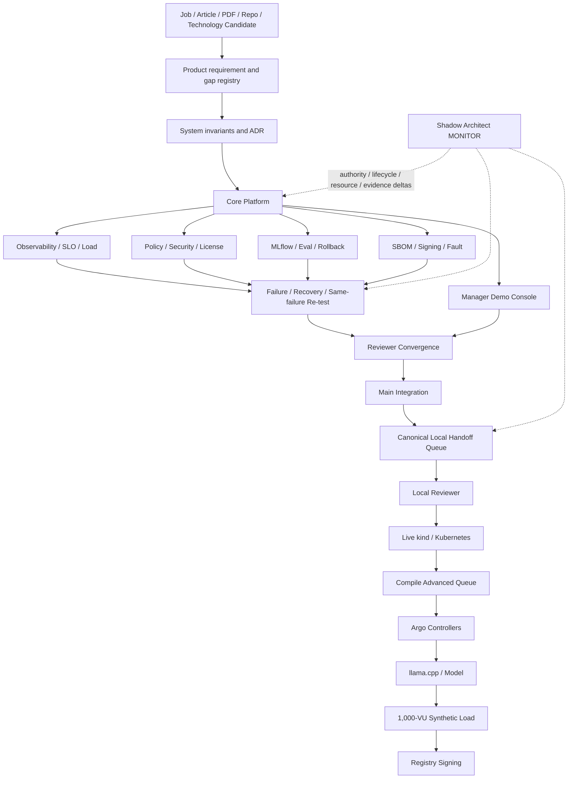

# DevOps Manager Notes

Public executable evidence plane for the **Full Manager MVP Demo**: an Internal AI Platform portfolio proving bounded Technical Product Manager and DevOps Manager capabilities with exact Git subjects, deterministic failure oracles, reviewer evidence and typed Local Handoff.

## Authority and control planes

```text
ed3c/skills-shared
  canonical Tech Lead / Shadow Architect / Git Town / Local Handoff method
        ↓
ed3c/Product-Manager-Notes
  job requirements / product decisions / gaps / interview narrative routing
        ↓ exact public-safe evidence request
ed3c/DevOps-Manager-Notes
  code / CI / runtime contracts / failure drills / receipts / Demo Console
        ↓ exact receipt and evidence ceiling
Product-Manager-Notes + Google projections
  interview and dashboard views; never evidence authority
```

GitHub is canonical. Google Doc, Google Sheet, issue prose and UI views are projections only.

## Current checkpoint

```text
M1 CORE_REMOTE_FIRST_GREEN                          PASS_BOUNDED
M2 PUBLIC_REMOTE_FANOUT_FIRST_GREEN                 PASS_BOUNDED
M3 PUBLIC_REMOTE_FAILURE_RECOVERY_FIRST_GREEN       PASS_BOUNDED
M4 PUBLIC_REMOTE_REVIEWER_CONVERGENCE_FIRST_GREEN   PASS_BOUNDED
M5 PUBLIC_LOCAL_KIND_RUNNER_AND_QUEUE_READY          PASS_BOUNDED
M6 PUBLIC_ADVANCED_RUNNER_CONTRACTS_READY            PASS_BOUNDED
M7 PUBLIC_ADVANCED_EXECUTION_BUNDLE_READY             PASS_BOUNDED
M8 PUBLIC_MAIN_INTEGRATION_AND_HANDOFF_READY           PASS_BOUNDED
```

M8 means the verified public implementation and contract surfaces are integrated into `main`, documentation is reconciled, and a new exact-subject Local Handoff queue is ready. It does **not** mean physical local execution or production experience.

### Integrated main subjects

| Capability | Integration | Exact merge subject | Maximum admitted claim |
|---|---|---|---|
| M1–M7 backbone | PR #68 | `d0ecbd05c1dfecc6ae65f62c9869cd6a1412da43` | repository integration of verified remote lanes |
| Manager Demo Console | PR #37 | `a47c0de9d5d0a176821a95c7a6c961ed7cf9f058` | frontend build and bounded evidence rendering |
| Policy / security / license | PR #38 | `cf7f0f5939e75475ce10da14f932de1a7f33b257` | hosted policy/security/license metadata, not legal clearance |
| ML/LLMOps lifecycle | PR #39 | `9e5b9c23467ff90a1c1452a255d4a6cfa245b6bf` | deterministic MLflow/eval/rollback contract |
| Supply chain / fault | PR #40 | `0b0709946e84e80918a0e50903badb8b7bd4fa12` | hosted SBOM/blob-signing/fault drill |
| Advanced runner tests/workflows | PR #69 | `bb940bf7d5a3b1f605b79e9fb8f33c463a8ee5a7` | runner contract evidence only |
| M8 Local Handoff execution subject | two-phase closure commit | `e7b4e23799a3579572598ebd5864a80831d49db4` / tree `0b72b9f09f73d3829db2f138d457a5691641bf79` | local commands may be attempted and receipted |

## Current proof frontier

```text
repository integration                              PASS_BOUNDED
Core API/PostgreSQL/Alembic/Docker CI               PASS_BOUNDED
observability/business oracle/20-VU smoke           PASS_BOUNDED
policy/security/license metadata                     PASS_BOUNDED
MLflow lifecycle/eval/rejection/rollback             PASS_BOUNDED
Demo Console build                                  PASS_BOUNDED
SBOM/same-run signing/bounded fault drill            PASS_BOUNDED
seven failure/recovery/re-test drills                PASS_BOUNDED
reviewer packet and artifact re-verification         PASS_BOUNDED
runner and queue compiler contracts                  PASS_BOUNDED

local deterministic reviewer                        NOT_EXERCISED
live kind/Kubernetes application smoke              NOT_EXERCISED
live advanced queue compilation                     NOT_EXERCISED
Argo controllers                                    NOT_EXERCISED
Argo CD Application reconciliation                  NOT_EXERCISED
live Argo Rollouts/Prometheus canary                NOT_EXERCISED
llama.cpp + exact model inference                   NOT_EXERCISED
synthetic 1,000-VU execution                        NOT_EXERCISED
registry-stored image signing                       NOT_EXERCISED
production users/incidents/tenure                   OUTSIDE_CURRENT_PROOF
people-management tenure                            OUTSIDE_REPOSITORY_PROOF
```

## Read order

```text
README.md
→ AGENTS.md
→ docs/INDEX.md
→ docs/architecture/FULL_MVP_DEMO.md
→ docs/milestones/PUBLIC_M8_MAIN_INTEGRATION.md
→ registry/public-m8-main-integration.json
→ registry/stack-plan.yaml
→ handoff/local-handoff-queue.json
→ exact issue / PR / commit / Actions run / artifact / receipt
```

Historical M2–M7 milestones and machine registries remain available through `docs/INDEX.md`.

## End-to-end State Machine

```text
SOURCE_BOUND
→ REQUIREMENT_CLASSIFIED
→ SYSTEM_CONTRACT_FROZEN
→ TECHNOLOGY_ADMITTED
→ WORKERS_ADMITTED
→ BUILD_TESTED
→ SBOM_CREATED
→ SECURITY_POLICY_ADMITTED
→ MODEL_CONFIG_REGISTERED
→ OFFLINE_EVAL_RUNNING
    ├─ EVAL_REJECTED
    └─ PROMOTION_ELIGIBLE
→ GITOPS_DESIRED_STATE_BOUND
→ CANARY_CONTRACT_READY
→ OBSERVED
→ LOAD_OR_FAULT_PROBE_RUNNING
→ HEALTHY | DEGRADED
→ INCIDENT_COMMAND_ACTIVE
→ MITIGATING
→ RECOVERED
→ POSTMORTEM_OPEN
→ CORRECTIVE_CHANGE_BOUND
→ SAME_FAILURE_RETEST
→ REVERIFIED
→ REVIEWER_PACKET_ASSEMBLED
→ REMOTE_DEMO_EVIDENCE_READY
→ MAIN_INTEGRATED
→ LOCAL_HANDOFF_READY
→ LOCAL_REVIEWER_ACTIVE
    ├─ FAIL → LOCAL_GAP_OPEN
    └─ PASS → LIVE_KIND_UNBLOCKED
→ LIVE_KIND_RUNNING
    ├─ FAIL → LOCAL_GAP_OPEN
    └─ PASS → ADVANCED_QUEUE_COMPILATION_UNBLOCKED
→ ADVANCED_QUEUE_COMPILING
    ├─ invalid/stale receipt → LOCAL_GAP_OPEN
    └─ PASS → ADVANCED_QUEUE_REVIEW_REQUIRED
→ ARGO_CONTROLLERS
→ LOCAL_MODEL
→ SYNTHETIC_1000_VU
→ REGISTRY_SIGNING
→ LOCAL_ADVANCED_EVIDENCE_READY
```

States after `LOCAL_HANDOFF_READY` are future physical states and remain `NOT_EXERCISED` until their own receipts exist.

## Directory → State Machine → DAG ownership

| Directory | State / transition owned | Implementation owner | Evidence ceiling |
|---|---|---|---|
| `platform/app/` | `BUILD_TESTED → BUSINESS_ORACLE_EVALUATED` | Core PR #14, integrated by #68 | hosted deterministic Core |
| `platform/docker/` | source → immutable image subject | Core / supply-chain | hosted image build identity |
| `platform/kubernetes/` | desired deployment → readiness contract | Core + live-kind runner | contract only until local receipt |
| `platform/gitops/` | desired state binding | architecture/Core | desired-state contract |
| `platform/rollouts/` | eval eligible → canary contract / rollback target | PR #39 | deterministic desired-state contract |
| `platform/policies/` | candidate → admitted/rejected | PR #38 | hosted OPA/security metadata |
| `mlops/` | register → evaluate → promote/reject → rollback | PR #39 | hosted MLflow lifecycle only |
| `observability/` | request → metric/trace/business signal | PR #36 | hosted telemetry and bounded load |
| `sre/` | SLI → SLO decision | PR #36 | synthetic/hosted evidence |
| `supply-chain/` | image → SBOM → sign/verify → tamper reject | PR #40 | same-run hosted blob evidence |
| `tests/failure/scenarios/` | trigger → detect → mitigate → recover → re-test | PR #42 | DRILL/SIMULATION only |
| `demo-console/` | canonical evidence → reviewer UI | PR #37 | rendering only |
| `scripts/demo/` | exact receipts → reviewer packet | PR #44 | deterministic reviewer evidence |
| `scripts/handoff/` | local command → typed receipt / next queue | PR #51/#52/#65, M8 closure | queue/runner contract until local run |
| `handoff/` | one ACTIVE item → receipt-gated successor | M8 Local Handoff queue | queue existence is not execution |
| `docs/milestones/` | evidence subject → bounded narrative | Tech Lead traceability owner | documentation only |
| `registry/` | exact subject / DAG / gap / evidence index | Tech Lead convergence owner | machine routing only |
| `incidents/` / `runbooks/` / `management/` | drill authority and recovery communication | PR #42 | simulated Manager process evidence |

## Task DAG and data flow



## Molecular Git Town / Stack PR index

### Historical implementation topology

```text
PR #6 bootstrap
└─ PR #12 Full MVP architecture
   └─ PR #13 invariant/evidence audit
      └─ PR #14 Core
         ├─ PR #36 Observability
         ├─ PR #37 Demo Console
         ├─ PR #38 Policy/Security
         ├─ PR #39 ML/LLMOps
         └─ PR #40 Supply/Fault

PR #36
└─ PR #42 Failure/Recovery
   └─ PR #44 Reviewer Convergence
      └─ PR #45 Local Handoff bootstrap
         └─ PR #51 Live-kind runner
            └─ PR #52 Canonical Local Handoff
               └─ PR #65 Advanced bundle/compiler

Task-sibling runner leaves:
PR #39 → PR #55 Argo
PR #39 → PR #56 Model
PR #36 → PR #57 Capacity
PR #40 → PR #58 Registry Signing
```

### Main integration topology

```text
X8 PR #68  backbone → main
A8 PR #37  Demo Console → main
E8 PR #38  Policy/Security → main
A8 PR #39  ML/LLMOps → main
E8 PR #40  Supply/Fault → main
X8 PR #69  exact advanced runner tests/workflows → main
D8 current closure PR  README/AGENTS/registry/queue → main
```

PR #55–#58 were closed as integrated/superseded after their exact runner bytes arrived through #68 and their exact tests/workflows through #69. Ancestor PRs are closed after reachability is recorded; they are not replay-merged.

## Local Handoff Execution Queue

Canonical queue: `handoff/local-handoff-queue.json`.

Execution subject:

```text
commit   e7b4e23799a3579572598ebd5864a80831d49db4
tree     0b72b9f09f73d3829db2f138d457a5691641bf79
rollback bb940bf7d5a3b1f605b79e9fb8f33c463a8ee5a7
```

Queue order:

```text
M8-LOCAL-REVIEWER-001             ACTIVE
  ↓ exact PASS receipt
M8-LIVE-KIND-002                  BLOCKED_BY_PREDECESSOR
  ↓ exact PASS receipt + cleanup
M8-COMPILE-ADVANCED-QUEUE-003     BLOCKED_BY_PREDECESSOR
  ↓ compile receipt + human queue review
M7 advanced queue                 NOT_COMPILED
```

First local command:

```bash
python3 scripts/handoff/run_local_reviewer_handoff.py \
  --output evidence/local-reviewer/handoff-receipt.json \
  --work-dir evidence/local-reviewer/work
```

Do not execute the kind or compiler item before the predecessor receipt is reviewed. The compiled advanced queue must pass the portable `skills-shared` assertion and selftest before any queue advancement.

## Residual issues

Keep open until physical evidence exists:

```text
#2  live kind/Kubernetes application acceptance
#3  real synthetic 1,000-VU execution
#7  exact model artifact/local inference/live canary
#9  final Local Handoff and advanced runtime convergence
#67 repository-admin deletion of orchestration-only temporary branches
```

All other stage-scoped issues may close only after the M8 closure PR is merged and their exact main reachability is commented.

## Forbidden promotions

```text
CI_GREEN                 → BUSINESS_CORRECT                 forbidden
RUNNER_CONTRACT_PASS     → PHYSICAL_RUNTIME_PASS            forbidden
QUEUE_EXISTS             → QUEUE_EXECUTED                   forbidden
FIXTURE_PASS             → LIVE_PREDECESSOR_PASS            forbidden
LOCAL_K8S_PASS           → PRODUCTION_INFRA_EXPERIENCE      forbidden
ARGO_CONTROLLERS_PASS    → APPLICATION_RECONCILIATION_PASS  forbidden
LOCAL_MODEL_PASS         → PRODUCTION_LLM_TRAFFIC           forbidden
1000_VU_PASS             → 1000_REAL_USERS                  forbidden
LOCAL_SIGNING_PASS       → PRODUCTION_KEY_CUSTODY           forbidden
DRILL_COMPLETE           → PRODUCTION_INCIDENT_HISTORY      forbidden
LICENSE_METADATA_PASS    → BLANKET_LEGAL_CLEARANCE          forbidden
REPOSITORY_ARTIFACT      → EMPLOYMENT_OR_MANAGER_TENURE     forbidden
```

Merge, release, visibility, permission, production promotion/rollback, provider credentials, queue advancement and real-experience claims remain Human/trusted-owner decisions.
