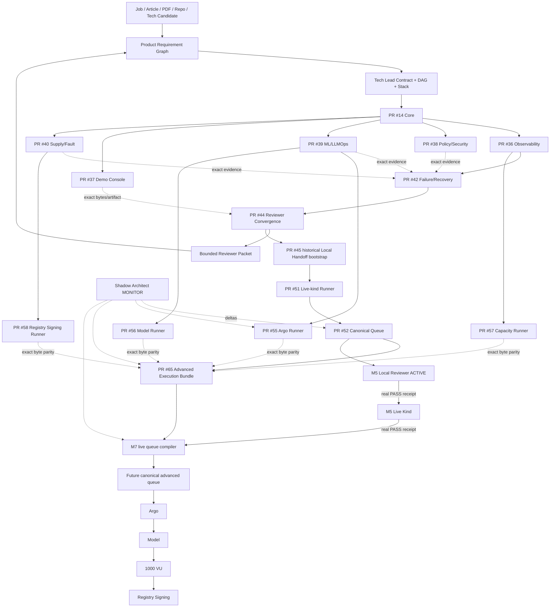

# DevOps Manager Notes

Public executable evidence plane for the **Full Manager MVP Demo**: an Internal AI Platform demo covering Technical Product Manager and DevOps Manager requirements through bounded, exact-subject evidence.

`Product-Manager-Notes` is the public-safe Manager requirement/routing/narrative plane. `skills-shared` owns canonical Tech Lead, Shadow Architect and Git Town procedures. This repository owns public-safe implementation, CI/runtime evidence, ML lifecycle, SLO/policy/supply-chain proof, failure/recovery drills, reviewer convergence, runtime runner contracts and typed Local Handoff.

## Current milestones

```text
M1 CORE_REMOTE_FIRST_GREEN                          PASS_BOUNDED
M2 PUBLIC_REMOTE_FANOUT_FIRST_GREEN                 PASS_BOUNDED
M3 PUBLIC_REMOTE_FAILURE_RECOVERY_FIRST_GREEN       PASS_BOUNDED
M4 PUBLIC_REMOTE_REVIEWER_CONVERGENCE_FIRST_GREEN   PASS_BOUNDED
M5 PUBLIC_LOCAL_KIND_RUNNER_AND_QUEUE_READY          PASS_BOUNDED
M6 PUBLIC_ADVANCED_RUNNER_CONTRACTS_READY            PASS_BOUNDED
M7 PUBLIC_ADVANCED_EXECUTION_BUNDLE_READY             PASS_BOUNDED
```

`PASS_BOUNDED` always names an evidence ceiling. It is never shorthand for production closure.

Current proof frontier:

```text
remote reviewer convergence                         PASS_BOUNDED
canonical Local Handoff contract                     PASS_BOUNDED
advanced runner contracts                            PASS_BOUNDED
advanced execution bundle + queue compiler           PASS_BOUNDED

real local deterministic reviewer                    NOT_EXERCISED
real live kind/Kubernetes application smoke          NOT_EXERCISED
live advanced queue compilation                      NOT_EXERCISED
Argo controllers                                      NOT_EXERCISED
Argo CD Application reconciliation                   NOT_EXERCISED
live Argo Rollouts/Prometheus canary                 NOT_EXERCISED
Qwen / llama.cpp local inference                     NOT_EXERCISED
1,000-VU synthetic execution                        NOT_EXERCISED
registry-stored image signing                        NOT_EXERCISED
production users/incidents/tenure                    OUTSIDE_CURRENT_PROOF
people-management tenure                             OUTSIDE_REPOSITORY_PROOF
```

## Read first

```text
README.md
→ AGENTS.md
→ docs/INDEX.md
→ docs/architecture/FULL_MVP_DEMO.md
→ docs/milestones/PUBLIC_M7_ADVANCED_EXECUTION_BUNDLE_READY.md
→ registry/public-m7-advanced-bundle.json
→ registry/stack-plan.yaml
→ handoff/local-handoff-queue.json
→ exact issue / PR / current head / evidence head / Actions run / artifact / receipt
```

Historical checkpoints remain reachable through M2 → M3 → M4 → M5 → M6 indexes under `docs/milestones/` and `registry/`.

## Authority boundary

```text
skills-shared
  canonical Tech Lead / Shadow Architect / Git Town methods
       ↓
Product-Manager-Notes
  source / job requirement / product decision / gap / narrative routing
       ↓ public-safe evidence request
DevOps-Manager-Notes
  app / CI / ML lifecycle / SLO / policy / supply-chain / failure / UI / runtime receipts
       ↓ exact evidence subject
Product-Manager-Notes
  competency closure / interview narrative / portfolio projection
```

GitHub is canonical for repository state and exact evidence subjects. Google Sheet/Doc remain non-authoritative projections.

Human-owned operations:

```text
merge / force-push / release
repository visibility or permission change
production promotion or rollback admission
provider / credential enrollment
semantic-conflict resolution
claims of real users, real incidents, production tenure or people-management tenure
```

## Eight-stage execution program

| Stage | Transition | Output |
|---|---|---|
| P0 Subject / authority | `REQUEST_BOUND → SUBJECT_ADMITTED` | exact repo/branch/commit/issue + authority + ceiling |
| P1 Source / evidence | `SUBJECT_ADMITTED → CONTEXT_ADMITTED` | source/claim/evidence/gap graph |
| P2 Problem closure / System Design | `CONTEXT_ADMITTED → SYSTEM_CONTRACT_EXTRACTED` | invariants, State Machines, SLO/failure contracts |
| P3 Technology / ADR | `SYSTEM_CONTRACT_EXTRACTED → ARCHITECTURE_ADMITTED` | selected/rejected stack + license/ops boundaries |
| P4 Tech Lead DAG / Stack | `ARCHITECTURE_ADMITTED → WORKERS_ADMITTED` | true dependency DAG + leases + molecular PR plan |
| P5 Implementation | `WORKERS_ADMITTED → FIRST_GREEN` | code/tests/CI/receipt per bounded lane |
| P6 Runtime / failure proof | `FIRST_GREEN → REVERIFIED` | load/fault/recovery/postmortem/re-test |
| P7 Convergence / handoff | `REVERIFIED → DEMO_EVIDENCE_READY` | reviewer packet + typed Local Handoff residuals |

Start-readiness and completion-readiness are separate edge classes. A readable parent contract may permit a worker to start; only an exact admitted receipt can satisfy a completion edge.

## End-to-end State Machine

```text
SOURCE_BOUND
→ BUILD_TESTED
→ SBOM_CREATED
→ SECURITY_POLICY_ADMITTED
→ ARTIFACT_SIGNED
→ MODEL_CONFIG_REGISTERED
→ OFFLINE_EVAL_RUNNING
    ├─ EVAL_REJECTED
    └─ PROMOTION_ELIGIBLE
→ GITOPS_DESIRED_STATE_BOUND
→ CANARY_RUNNING
    ├─ CANARY_REJECTED → ROLLBACK_RUNNING
    └─ PROMOTED
→ OBSERVED
→ LOAD_OR_FAULT_PROBE_RUNNING
→ HEALTHY | DEGRADED
→ INCIDENT_COMMAND_ACTIVE
→ MITIGATING
→ RECOVERED
→ POSTMORTEM_OPEN
→ CORRECTIVE_CHANGE_BOUND
→ SAME_FAILURE_RETEST
→ REVERIFIED
→ REVIEWER_PACKET_ASSEMBLED
→ REMOTE_DEMO_EVIDENCE_READY
→ CANONICAL_LOCAL_HANDOFF_READY
→ LOCAL_REVIEWER_ACTIVE
    ├─ PASS → LIVE_KIND_UNBLOCKED
    └─ FAIL → LOCAL_GAP_OPEN
→ LIVE_KIND_RUNNING
    ├─ PASS → LOCAL_KIND_EVIDENCE_READY
    └─ FAIL → LOCAL_GAP_OPEN
→ ADVANCED_RUNNER_CONTRACTS_READY
→ ADVANCED_EXECUTION_BUNDLE_READY
→ LIVE_ADVANCED_QUEUE_COMPILATION
    ├─ predecessor receipts absent/fail → LOCAL_GAP_OPEN
    └─ both predecessor receipts admitted → ADVANCED_QUEUE_READY
→ ARGO_CONTROLLERS
→ LOCAL_MODEL
→ SYNTHETIC_1000_VU
→ REGISTRY_SIGNING
→ LOCAL_ADVANCED_EVIDENCE_READY
```

The states after `ADVANCED_EXECUTION_BUNDLE_READY` are future runtime states. They remain `NOT_EXERCISED` until real local receipts exist.

Illegal promotions:

```text
CI_GREEN                 → BUSINESS_CORRECT                 forbidden
REMOTE_FIRST_GREEN       → PRODUCTION_RUNTIME               forbidden
RUNNER_CONTRACT_PASS     → PHYSICAL_RUNTIME_PASS            forbidden
QUEUE_COMPILER_PASS      → QUEUE_EXECUTED                   forbidden
FIXTURE_PASS             → LIVE_PREDECESSOR_PASS            forbidden
LOCAL_REVIEWER_PASS      → LIVE_KIND_PASS                   forbidden
LOCAL_K8S_PASS           → PRODUCTION_INFRA_EXPERIENCE      forbidden
ARGO_CONTROLLERS_PASS    → APPLICATION_RECONCILIATION_PASS  forbidden
LOCAL_MODEL_PASS         → PRODUCTION_LLM_TRAFFIC           forbidden
1000_VU_PASS             → 1000_REAL_USERS                  forbidden
LOCAL_SIGNING_PASS       → PRODUCTION_KEY_CUSTODY           forbidden
DRILL_COMPLETE           → PRODUCTION_INCIDENT_HISTORY      forbidden
LICENSE_METADATA_PASS    → BLANKET_LEGAL_CLEARANCE          forbidden
CURRENT_PR_HEAD          → HISTORICAL_ARTIFACT_EVIDENCE     forbidden
```

## Repository topology

```text
DevOps-Manager-Notes/
├── README.md
├── AGENTS.md
├── docs/
│   ├── INDEX.md
│   ├── architecture/
│   ├── evidence-audit/
│   └── milestones/
│       ├── PUBLIC_REMOTE_FANOUT_FIRST_GREEN.md
│       ├── PUBLIC_REMOTE_FAILURE_RECOVERY_FIRST_GREEN.md
│       ├── PUBLIC_REMOTE_REVIEWER_CONVERGENCE_FIRST_GREEN.md
│       ├── PUBLIC_M5_LOCAL_KIND_RUNNER_READY.md
│       ├── PUBLIC_M6_ADVANCED_RUNNER_CONTRACTS_READY.md
│       └── PUBLIC_M7_ADVANCED_EXECUTION_BUNDLE_READY.md
├── registry/
│   ├── evidence.yaml
│   ├── gaps.yaml
│   ├── mvp-demo-stack.yaml
│   ├── stack-plan.yaml
│   ├── public-m2-first-green.json
│   ├── public-m3-failure-recovery.json
│   ├── public-m4-reviewer-convergence.json
│   ├── public-m5-local-kind-readiness.json
│   ├── public-m6-runner-contracts.json
│   └── public-m7-advanced-bundle.json
├── platform/
│   ├── app/
│   ├── docker/
│   ├── kubernetes/
│   ├── gitops/
│   ├── rollouts/
│   └── policies/
├── mlops/
├── demo-console/
├── observability/
├── sre/
├── supply-chain/
├── tests/
│   ├── unit/
│   ├── integration/
│   ├── load/
│   ├── failure/scenarios/
│   └── handoff/
│       └── fixtures/m7/
├── incidents/
├── runbooks/
├── management/
├── scripts/
│   ├── demo/
│   └── handoff/
│       ├── run_local_reviewer_handoff.py
│       ├── run_live_kind_smoke.py
│       ├── run_live_kind_from_env.sh
│       ├── run_argo_control_plane.py
│       ├── run_argo_control_plane_from_env.sh
│       ├── run_argo_ephemeral_kind.py
│       ├── run_argo_ephemeral_kind_from_env.sh
│       ├── run_local_model.py
│       ├── run_local_model_from_env.sh
│       ├── run_local_capacity.py
│       ├── run_local_registry_signing.py
│       ├── run_local_registry_signing_from_env.sh
│       └── compile_m7_advanced_queue.py
├── handoff/
│   └── local-handoff-queue.json
├── evidence/receipts/
└── .github/workflows/
```

Path presence is not capability evidence.

## Directory → State Machine → DAG ownership

| Surface | State responsibility | Owner | Current ceiling |
|---|---|---:|---|
| `system-design/` | requirement → invariant/failure contract | #1 / PR #13 | design/static |
| `platform/app/`, `docker/`, `kubernetes/`, `gitops/` | request → artifact → desired deployment | #2 / PR #14 | remote deterministic/container |
| `observability/`, `sre/`, `tests/load/` | execution → trace/SLI/SLO/load | #3 / PR #36 | remote telemetry + synthetic smoke |
| `platform/policies/` | candidate → admit/reject | #4 / PR #38 | policy/security/license metadata |
| `mlops/`, `platform/rollouts/` | model/prompt/config → eval → canary/rollback contract | #7 / PR #39 | deterministic MLflow lifecycle |
| `demo-console/` | canonical evidence → reviewer UI | #8 / PR #37 | frontend build/render |
| `supply-chain/`, network faults | artifact → SBOM/signature/fault | #10 / PR #40 | same-run signing + bounded drill |
| incident/runbook/management/failure scenarios | failure → authority → recovery → re-test | #5 / PR #42 | deterministic/local-process DRILL |
| `scripts/demo/`, convergence receipts | exact evidence → reviewer packet | #9 / PR #44 | remote reviewer + artifact re-verification |
| canonical `handoff/local-handoff-queue.json` | predecessor → local command → PASS/FAIL receipt | #48 / PR #52 | canonical queue contract only |
| `run_live_kind_*` | isolated kind → immutable app smoke | #47 / PR #51 | runner contract only |
| `run_argo_control_plane*`, `run_argo_ephemeral_kind*` | bounded ephemeral kind → Argo controllers ready | #54/#60 / PR #55 | runner contract only |
| `run_local_model*` | exact llama/model identity → bounded inference | #54 / PR #56 | runner contract only |
| `run_local_capacity.py` | loopback app → bounded 1,000-VU experiment | #54 / PR #57 | runner contract only |
| `run_local_registry_signing*` | exact local registry/cosign identity → digest sign/verify | #54 / PR #58 | runner contract only |
| `compile_m7_advanced_queue.py`, M7 fixtures | admitted predecessor receipts → future canonical advanced queue | #60/#62/#64 / PR #65 | compiler/fixture contract only |
| M7 milestone/index | exact M6/M7 subjects → Agent/readme routing | #63 / M7 docs PR | traceability only |

## Full data flow



## Observed molecular Git Town Stack

Machine authority: `registry/stack-plan.yaml`.

```text
C0 PR #6
└─ C11 PR #12
   └─ E1 PR #13
      └─ K2 PR #14 Core
         ├─ A3  PR #36 Observability
         ├─ E4  PR #38 Policy/Security
         ├─ A7  PR #39 ML/LLMOps
         ├─ A8  PR #37 Demo Console
         └─ E10 PR #40 Supply/Fault

PR #36
└─ X5 PR #42 Failure/Recovery
     ↑ exact side evidence #38/#39/#40

PR #42
└─ X9 PR #44 Reviewer Convergence
     ↑ exact Demo Console bytes #37 + M2/M3 artifacts
     └─ D9 PR #45 historical Local Handoff bootstrap
          └─ K5 PR #51 Live-kind Runner
               └─ D5 PR #52 Canonical Local Handoff Queue
                    └─ X7 PR #65 Advanced Execution Bundle
                         ↑ exact runner bytes #55/#56/#57/#58

M6 task siblings with real Git parents:
PR #39 ├─ A6 PR #55 Argo
       └─ A6 PR #56 Model
PR #36 └─ E6 PR #57 Capacity
PR #40 └─ E6 PR #58 Registry Signing
```

Task convergence and Git ancestry are distinct graphs. No fake multi-parent Git history is created.

## Canonical Local Handoff

Current method:

```text
ed3c/skills-shared@4ca9417b1da5ff32f1d4d3e7af64a15908749024
schema: agentic-tech-lead/local-handoff-queue/v1
validator: skills/agentic-tech-lead-orchestration/scripts/assert_local_handoff_queue.py
```

Current canonical queue PR #52:

```text
current head       f7a3937d7d0979e3adfaf1ebc4adc0532450d925
execution commit   4cc3e162c00a3af240bab9e62482e07bb3e4f9a1
execution tree     5ff3349c1eb5c7976263c2e89347a353ccbc1072
contract run       32263239722 PASS
```

Current physical queue:

```text
M5-LOCAL-REVIEWER-001       ACTIVE / receipt ABSENT
        ↓ real PASS required
M5-LIVE-KIND-002            BLOCKED_BY_PREDECESSOR / receipt ABSENT
        ↓ real PASS required
M6-ADVANCED-SUBSTRATE-003   BLOCKED_BY_PREDECESSOR
```

PR #65 does not mutate this queue and does not skip it. It merely compiles the next queue shape when both real predecessor receipts are eventually supplied.

## M7 exact contract subject

```text
PR       #65
head     cf63e2fc85d56c2e49cfefd33fefbec30316e1fa
tree     7dce94e01dd3630662deb6dfb3c67c8b5f272bb0
run      32275551599 SUCCESS
ceiling  GITHUB_HOSTED_M7_ADVANCED_BUNDLE_AND_QUEUE_COMPILER_ONLY
```

The CI proves exact imported byte parity, receipt-admission negative controls, explicit fixture/live separation, one-ACTIVE queue topology and the canonical portable assertion/selftest. It executes no physical runtime.

## Selected MVP stack

Machine inventory: `registry/mvp-demo-stack.yaml`.

```text
Python / FastAPI / Pydantic
PostgreSQL / SQLAlchemy / Alembic
React / Vite / TanStack Query / Apache ECharts
MLflow / llama.cpp + separately pinned model artifact
Docker CLI / Moby / kind / Kubernetes
Argo CD / Argo Rollouts
OpenTelemetry / Prometheus / Jaeger
OPA / Trivy / Syft / Cosign
Locust / Toxiproxy / pytest
GitHub Actions
```

Top-level licenses do not recursively clear transitive packages, images, plugins, model weights, downloaded binaries, Actions or SaaS terms.

## Evidence ladder

```text
L0 SOURCE_CLAIM
L1 STATIC_REASONING
L2 DETERMINISTIC_TEST
L3 LOCAL_INTEGRATION
L4 REAL_SUBSTRATE
L5 ADVERSARIAL_OR_CHAOS
L6 PRODUCTION_OBSERVATION
```

States:

```text
PASS
FAIL
ABSENT
NOT_IMPLEMENTED
NOT_EXERCISED
SKIPPED_BY_POLICY
HUMAN_ADMIT_REQUIRED
```

Lower evidence never self-promotes.

## Next legal frontier

```text
M7 bundle/compiler contract             PASS_BOUNDED
        ↓
M5-LOCAL-REVIEWER-001                   real receipt required
        ↓ PASS
M5-LIVE-KIND-002                        real receipt required
        ↓ PASS
compile M7 canonical advanced queue     live compilation allowed
        ↓
M7-ARGO-CONTROLLERS-001                 physical execution
        ↓ PASS
M7-LOCAL-MODEL-002
        ↓ PASS
M7-CAPACITY-003
        ↓ PASS
M7-REGISTRY-SIGNING-004
```

Public GitHub work can prepare and verify contracts, exact subjects, tests and routing. It cannot manufacture the missing physical receipts.
