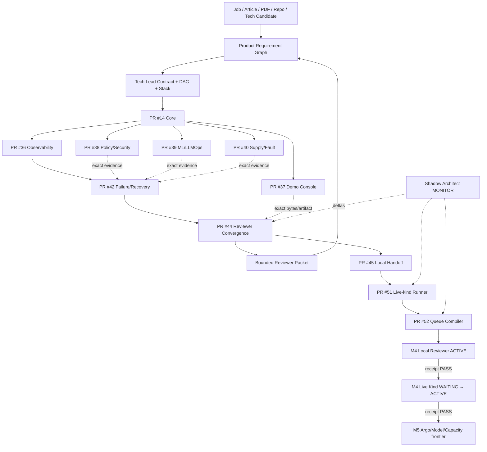

# DevOps Manager Notes

Public executable evidence plane for the **Full Manager MVP Demo**: an Internal AI Platform demo that covers Technical Product Manager and DevOps Manager requirements through explicit, bounded evidence.

`Product-Manager-Notes` is the public-safe Manager requirement/routing/narrative plane. `skills-shared` owns reusable Tech Lead, Shadow Architect and Git Town procedures. This repository owns public-safe implementation, CI/runtime evidence, ML lifecycle, SLO/policy/supply-chain proof, failure/recovery drills, the recruiter-facing Demo Console, reviewer convergence and typed Local Handoff.

## Current milestones

```text
M1 CORE_REMOTE_FIRST_GREEN                         PASS_BOUNDED
M2 PUBLIC_REMOTE_FANOUT_FIRST_GREEN                PASS_BOUNDED
M3 PUBLIC_REMOTE_FAILURE_RECOVERY_FIRST_GREEN      PASS_BOUNDED
M4 PUBLIC_REMOTE_REVIEWER_CONVERGENCE_FIRST_GREEN  PASS_BOUNDED
M5 PUBLIC_LOCAL_KIND_RUNNER_AND_QUEUE_READY         PASS_BOUNDED
```

M5 is **runner/queue readiness**, not a kind/Kubernetes runtime PASS. The current public proof frontier is:

```text
remote reviewer convergence              PASS_BOUNDED
local deterministic reviewer             NOT_EXERCISED
local kind/Kubernetes application smoke  NOT_EXERCISED
Argo CD / Rollouts runtime               NOT_EXERCISED
Qwen / llama.cpp runtime                 NOT_EXERCISED
1,000-VU capacity/recovery               NOT_EXERCISED
production users/incidents/tenure        OUTSIDE_CURRENT_PROOF
```

Canonical milestone indexes:

```text
docs/milestones/PUBLIC_REMOTE_FANOUT_FIRST_GREEN.md
registry/public-m2-first-green.json

docs/milestones/PUBLIC_REMOTE_FAILURE_RECOVERY_FIRST_GREEN.md
registry/public-m3-failure-recovery.json

docs/milestones/PUBLIC_REMOTE_REVIEWER_CONVERGENCE_FIRST_GREEN.md
registry/public-m4-reviewer-convergence.json

docs/milestones/PUBLIC_M5_LOCAL_KIND_RUNNER_READY.md
registry/public-m5-local-kind-readiness.json

registry/stack-plan.yaml
```

`FIRST_GREEN` is a checkpoint, never production closure.

## Read first

```text
README.md
→ AGENTS.md
→ docs/INDEX.md
→ docs/architecture/FULL_MVP_DEMO.md
→ docs/milestones/PUBLIC_REMOTE_FANOUT_FIRST_GREEN.md
→ docs/milestones/PUBLIC_REMOTE_FAILURE_RECOVERY_FIRST_GREEN.md
→ docs/milestones/PUBLIC_REMOTE_REVIEWER_CONVERGENCE_FIRST_GREEN.md
→ docs/milestones/PUBLIC_M5_LOCAL_KIND_RUNNER_READY.md
→ registry/mvp-demo-stack.yaml
→ registry/stack-plan.yaml
→ registry/public-m2-first-green.json
→ registry/public-m3-failure-recovery.json
→ registry/public-m4-reviewer-convergence.json
→ registry/public-m5-local-kind-readiness.json
→ handoff/local-handoff-queue.json
→ exact issue / PR / commit / Actions run / artifact / receipt
```

## Authority boundary

```text
skills-shared
  Tech Lead / Shadow Architect / Git Town methods
       ↓
Product-Manager-Notes
  source / requirement / product decision / gap / routing graph
       ↓ public-safe evidence request
DevOps-Manager-Notes
  app / CI / ML lifecycle / SLO / policy / supply-chain / failure / UI / runtime receipts
       ↓ exact evidence subject
Product-Manager-Notes
  competency closure / interview narrative / portfolio projection
```

GitHub repository metadata is the visibility source of truth. Public reachability does not promote evidence and never authorizes credentials, user/customer private data, employer/client confidential material or redistribution-restricted material. Merge, release, visibility/permissions, production promotion/rollback and real-experience claims remain Human-owned.

## Eight-stage execution program

| Stage | Transition | Output |
|---|---|---|
| P0 Subject / authority | `REQUEST_BOUND → SUBJECT_ADMITTED` | exact repo/branch/commit/issue + authority + ceiling |
| P1 Source / evidence | `SUBJECT_ADMITTED → CONTEXT_ADMITTED` | source/claim/evidence/gap graph |
| P2 Problem closure / System Design | `CONTEXT_ADMITTED → SYSTEM_CONTRACT_EXTRACTED` | invariants, State Machines, SLO/failure contracts |
| P3 Technology / ADR | `SYSTEM_CONTRACT_EXTRACTED → ARCHITECTURE_ADMITTED` | selected/rejected stack + license/ops boundaries |
| P4 Tech Lead DAG / Stack | `ARCHITECTURE_ADMITTED → WORKERS_ADMITTED` | real dependency DAG + leases + molecular PR plan |
| P5 Implementation | `WORKERS_ADMITTED → FIRST_GREEN` | code/tests/CI/receipt per bounded lane |
| P6 Runtime / failure proof | `FIRST_GREEN → REVERIFIED` | load/fault/recovery/postmortem/re-test |
| P7 Convergence / handoff | `REVERIFIED → DEMO_EVIDENCE_READY` | reviewer packet + Local Handoff residuals |

M2/M3/M4 are remote proof checkpoints. M5 compiles the first concrete local-substrate command while respecting predecessor receipts.

## End-to-end State Machine

```text
SOURCE_BOUND
→ BUILD_TESTED
→ SBOM_CREATED
→ SECURITY_POLICY_ADMITTED
→ ARTIFACT_SIGNED
→ MODEL_CONFIG_REGISTERED
→ OFFLINE_EVAL_RUNNING
    ├─ EVAL_REJECTED
    └─ PROMOTION_ELIGIBLE
→ GITOPS_DESIRED_STATE_BOUND
→ CANARY_RUNNING
    ├─ CANARY_REJECTED → ROLLBACK_RUNNING
    └─ PROMOTED
→ OBSERVED
→ LOAD_OR_FAULT_PROBE_RUNNING
→ HEALTHY | DEGRADED
→ INCIDENT_COMMAND_ACTIVE
→ MITIGATING
→ RECOVERED
→ POSTMORTEM_OPEN
→ CORRECTIVE_CHANGE_BOUND
→ SAME_FAILURE_RETEST
→ REVERIFIED
→ REVIEWER_INPUTS_BOUND
→ ARTIFACTS_REDOWNLOADED
→ ARTIFACT_DIGESTS_VERIFIED
→ REVIEWER_PACKET_ASSEMBLED
→ REMOTE_DEMO_EVIDENCE_READY
→ LOCAL_HANDOFF_ACTIVE
    ├─ LOCAL_REVIEWER_PASS → LIVE_KIND_WAITING
    └─ LOCAL_REVIEWER_FAIL → LOCAL_GAP_OPEN
→ LIVE_KIND_RUNNING
    ├─ LIVE_KIND_PASS → LOCAL_KIND_EVIDENCE_READY
    └─ LIVE_KIND_FAIL → LOCAL_GAP_OPEN
→ ADVANCED_SUBSTRATE_BLOCKED | ADVANCED_SUBSTRATE_READY
```

Illegal promotions:

```text
CI_GREEN               → BUSINESS_CORRECT               forbidden
REMOTE_FIRST_GREEN     → PRODUCTION_RUNTIME             forbidden
RUNNER_CONTRACT_PASS   → LOCAL_KIND_PASS                forbidden
QUEUE_CONTRACT_PASS    → QUEUE_EXECUTED                 forbidden
LOCAL_REVIEWER_PASS    → LIVE_KIND_PASS                 forbidden
LOCAL_K8S_PASS         → PRODUCTION_INFRA_EXPERIENCE    forbidden
1000_VU_PASS           → 1000_REAL_USERS                forbidden
DRILL_COMPLETE         → PRODUCTION_INCIDENT_HISTORY    forbidden
LICENSE_METADATA_PASS  → BLANKET_LEGAL_CLEARANCE        forbidden
UI_GREEN               → BACKEND_EVIDENCE_PASS          forbidden
CURRENT_PR_HEAD         → HISTORICAL_ARTIFACT_EVIDENCE  forbidden
```

## Repository topology

```text
DevOps-Manager-Notes/
├── README.md
├── AGENTS.md
├── docs/
│   ├── INDEX.md
│   ├── architecture/
│   ├── evidence-audit/
│   └── milestones/
│       ├── PUBLIC_REMOTE_FANOUT_FIRST_GREEN.md
│       ├── PUBLIC_REMOTE_FAILURE_RECOVERY_FIRST_GREEN.md
│       ├── PUBLIC_REMOTE_REVIEWER_CONVERGENCE_FIRST_GREEN.md
│       └── PUBLIC_M5_LOCAL_KIND_RUNNER_READY.md
├── registry/
│   ├── evidence.yaml
│   ├── gaps.yaml
│   ├── mvp-demo-stack.yaml
│   ├── stack-plan.yaml
│   ├── public-m2-first-green.json
│   ├── public-m3-failure-recovery.json
│   ├── public-m4-reviewer-convergence.json
│   └── public-m5-local-kind-readiness.json
├── platform/
│   ├── app/
│   ├── docker/
│   ├── kubernetes/
│   ├── gitops/
│   ├── rollouts/
│   └── policies/
├── mlops/
├── demo-console/
├── observability/
├── sre/
├── supply-chain/
├── tests/
│   ├── unit/
│   ├── integration/
│   ├── load/
│   ├── failure/scenarios/
│   └── handoff/
├── incidents/
├── runbooks/
├── management/
├── scripts/
│   ├── demo/
│   └── handoff/
│       ├── run_live_kind_smoke.py
│       └── run_live_kind_from_env.sh
├── handoff/local-handoff-queue.json
├── evidence/receipts/
└── .github/workflows/
```

Directories are created only with real artifacts. Path presence is not capability proof.

## Directory → State Machine → DAG owner

| Surface | State responsibility | Owner | Evidence ceiling |
|---|---|---:|---|
| `system-design/` | requirement → invariant/failure contract | #1 / PR #13 | design/static |
| `platform/app/`, `docker/`, `kubernetes/`, `gitops/` | request → artifact → desired deployment | #2 / PR #14 | remote deterministic/container; live K8s separate |
| `observability/`, `sre/`, `tests/load/` | execution → trace/SLI/SLO/load | #3 / PR #36 | remote telemetry + synthetic smoke |
| `platform/policies/` | candidate → admit/reject | #4 / PR #38 | policy/security/license metadata |
| `mlops/`, `platform/rollouts/` | model/prompt/config → eval → canary/rollback contract | #7 / PR #39 | deterministic MLflow lifecycle |
| `demo-console/` | canonical evidence → reviewer UI | #8 / PR #37 | frontend build/render |
| `supply-chain/`, network faults | artifact → SBOM/signature/fault | #10 / PR #40 | same-run signing + bounded drill |
| incident/runbook/management/failure scenarios | failure → authority → recovery → re-test | #5 / PR #42 | deterministic/local-process DRILL |
| `scripts/demo/`, convergence receipts | exact evidence → reviewer packet | #9 / PR #44 | remote reviewer + artifact re-verification |
| `handoff/local-handoff-queue.json` | runtime predecessor → concrete local command → receipt | #9 / PR #45, #48 / PR #52 | queue contract only |
| `scripts/handoff/run_live_kind_*`, `tests/handoff/` | local substrate plan → bounded runner | #47 / PR #51 | GitHub-hosted runner contract only until local execution |

## Full data flow



## Observed molecular Git Town Stack

Machine authority: `registry/stack-plan.yaml`.

```text
C0    PR #6   bootstrap                                      ROOT
└─ C11 PR #12 Full MVP architecture                         TRUE_CHILD
   └─ E1  PR #13 evidence/invariant freeze                  TRUE_CHILD
      └─ K2  PR #14 Core                                    TRUE_CHILD
         ├─ A3  PR #36 Observability                        SIBLING
         ├─ E4  PR #38 Policy/Security                      SIBLING
         ├─ A7  PR #39 ML/LLMOps                            SIBLING
         ├─ A8  PR #37 Demo Console                         SIBLING
         └─ E10 PR #40 Supply/Fault                         SIBLING

PR #36
└─ X5 PR #42 Failure/Recovery                               TRUE_CHILD + CONVERGENCE
     ↑ exact side evidence #38/#39/#40

PR #42
└─ X9 PR #44 Reviewer Convergence                           TRUE_CHILD + CONVERGENCE
     ↑ exact Demo Console bytes #37 + M2/M3 artifacts
     └─ D9 PR #45 Local Handoff                             TRUE_CHILD
          └─ K5 PR #51 Live-kind Runner                     TRUE_CHILD
               └─ D5 PR #52 Queue Compiler                  TRUE_CHILD
```

Task convergence and Git ancestry are separate graphs. No fake multi-parent Git history is created.

## M4 remote reviewer receipts

```text
PR #44 head 55d18cdc556ca5d66c67406318ae25196c077fd2

Deterministic reviewer:
  run      32256802856
  artifact 9366615717
  digest   sha256:e652cdf3ccb8de7a8655f9148bc6471a29bcaeaef2d55f6255bca2cb2b1e19d3
  ceiling  GITHUB_HOSTED_REMOTE_REVIEWER_CONVERGENCE_ONLY

Artifact re-download/reviewer bundle:
  run      32256802554
  artifact 9366596481
  digest   sha256:696f56be2fb637e386941eb313caa7c9448900ad0bad88b3a96119b95315596c
  ceiling  GITHUB_HOSTED_ARTIFACT_REDOWNLOAD_AND_REVIEWER_BUNDLE_ONLY
```

## M5 runner and queue subjects

### Runner PR #51

```text
head      20d2ccb0ed8c877309452eece7c755bb3411c4c1
tree      7d4b5d5aaba2d023803b152ce5ac7f23f274eba0
CI run    32259961112 SUCCESS
ceiling   GITHUB_HOSTED_LOCAL_RUNNER_CONTRACT_ONLY
runtime   NOT_EXERCISED
```

Shadow corrections: restore caller kubectl context, cleanup partial cluster creation, bind exact node-image digest, align resource/timeout language, retain failed intermediate CI as non-admitted evidence.

### Queue PR #52

```text
head      660d4deea81712f3d6ab5288ae09288b2e15cc27
CI run    32260403160 SUCCESS
ceiling   GITHUB_HOSTED_LOCAL_HANDOFF_CONTRACT_VALIDATION_ONLY
```

Queue state:

```text
M4-LOCAL-REVIEWER-001     ACTIVE
M4-LIVE-SUBSTRATE-002     WAITING_PREDECESSOR
M5-ARGO-MODEL-CAPACITY-003 BLOCKED_UNRESOLVED
```

A future live-kind invocation is bound to:

```bash
M5_KIND_NODE_IMAGE='<exact-name>@sha256:<64-hex>' \
bash scripts/handoff/run_live_kind_from_env.sh \
  --output evidence/local-kind/local-kind-receipt.json \
  --cluster-name manager-demo-m5 \
  --local-port 18030
```

Do not execute the second item before the current active local-reviewer receipt passes.

## Selected MVP stack

Machine inventory: `registry/mvp-demo-stack.yaml`.

```text
Python / FastAPI / Pydantic
PostgreSQL / SQLAlchemy / Alembic
React / Vite / TanStack Query / Apache ECharts
MLflow / llama.cpp + separately pinned model artifact
Docker CLI / Moby / kind / Kubernetes
Argo CD / Argo Rollouts
OpenTelemetry / Prometheus / Jaeger
OPA / Trivy / Syft / Cosign
Locust / Toxiproxy / pytest
GitHub Actions
```

Top-level licenses do not recursively clear transitive packages, images, plugins, model weights, downloaded binaries, Actions or SaaS terms.

## Evidence ladder

```text
L0 SOURCE_CLAIM
L1 STATIC_REASONING
L2 DETERMINISTIC_TEST
L3 LOCAL_INTEGRATION
L4 REAL_SUBSTRATE
L5 ADVERSARIAL_OR_CHAOS
L6 PRODUCTION_OBSERVATION
```

States:

```text
PASS
FAIL
ABSENT
NOT_IMPLEMENTED
NOT_EXERCISED
SKIPPED_BY_POLICY
HUMAN_ADMIT_REQUIRED
```

Lower evidence never self-promotes.

## Next legal frontier

```text
M5 runner + queue readiness  PASS_BOUNDED
        ↓
M4-LOCAL-REVIEWER-001        requires real local receipt
        ↓ PASS_BOUNDED
M4-LIVE-SUBSTRATE-002        becomes executable/ACTIVE
        ↓ real local PASS
LOCAL_KIND_KUBERNETES_APPLICATION_SMOKE_ONLY
        ↓
compile exact Argo / model / 1,000-VU runners before activation
```

The remote engineering work for this checkpoint is stage-complete. Further capability promotion requires exact Local Handoff receipts; README/CI/queue state cannot substitute for physical execution.
