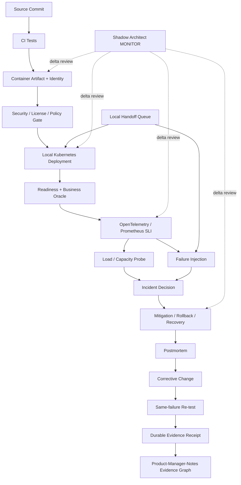

# DevOps Manager Notes

Public, executable evidence repository for DevOps Manager / Platform Engineering / SRE management capability.

This repository is the **execution and public evidence plane** for the Manager Evidence Graph. `Product-Manager-Notes` routes requirements and evidence requests here; this repository owns the reproducible delivery/reliability implementation, negative controls, failure/recovery exercises, and exact public-safe receipts.

The central case is an Internal Platform Delivery & Reliability Lab that moves from source change to verified deployment, observability, failure injection, rollback, postmortem, corrective change, and same-failure re-verification.

## Plane boundary

```text
Product-Manager-Notes
  requirement / gap / product decision / evidence request
          │
          ▼
DevOps-Manager-Notes
  executable delivery + reliability proof
          │
          ├──► exact PR/commit/test/runtime receipt
          └──► public-safe evidence reference back to Product

skills-shared = reusable procedure owner
runtime-env   = optional secret-free runtime-contract owner
Google Docs/Sheets = non-authoritative human projections
```

No public evidence here requires private repository access. No document may represent a drill as a production outage, virtual users as real adoption, local Kubernetes as production infrastructure tenure, or CI green as business correctness.

## Canonical state machine

```text
PROBLEM_BOUND
→ SLO_DEFINED
→ DELIVERY_PATH_IMPLEMENTED
→ DEPLOYMENT_PROVED
→ OBSERVABILITY_PROVED
→ FAILURE_INJECTED
→ MITIGATION_PROVED
→ ROLLBACK_OR_RECOVERY_PROVED
→ POSTMORTEM_CLOSED
→ PREVENTIVE_CHANGE_VERIFIED

stale / mismatched / lower-lane evidence
→ GAP_REOPENED
```

Implementation-level state machine for the first lab:

```text
SOURCE_BOUND
→ BUILD_ADMITTED
→ ARTIFACT_VERIFIED
→ DEPLOYMENT_ADMITTED
→ RUNNING
→ OBSERVED
→ FAILURE_INJECTED
→ DEGRADED
→ MITIGATING
→ RECOVERED
→ POSTMORTEM_OPEN
→ CORRECTIVE_CHANGE_BOUND
→ REVERIFIED
→ CLOSED
```

Illegal promotions:

```text
BUILD_GREEN      → PRODUCTION_PROVEN          forbidden
LOCAL_K8S_PASS   → REAL_CLUSTER_PROVEN        forbidden
LOAD_TEST_PASS   → REAL_ADOPTION_PROVEN       forbidden
DRILL_COMPLETE   → PRODUCTION_INCIDENT_EXP    forbidden
SKIPPED_CHECK    → PASS                       forbidden
ISSUE_CLOSED     → RUNTIME_CLOSED             forbidden
```

## Target repository topology

```text
DevOps-Manager-Notes/
├── AGENTS.md
├── README.md
├── LICENSE
├── docs/
│   ├── INDEX.md
│   └── architecture/
│       └── DELIVERY_RELIABILITY_LAB.md
├── roles/
│   └── devops-manager/
│       └── job-contract.yaml
├── registry/
│   ├── evidence.yaml
│   ├── gaps.yaml
│   ├── technology-candidates.yaml
│   └── stack-plan.yaml
├── system-design/
│   ├── cicd-platform.md
│   ├── kubernetes-platform.md
│   ├── release-system.md
│   ├── observability.md
│   └── disaster-recovery.md
├── sre/
│   ├── sli-slo.md
│   ├── error-budget.md
│   ├── capacity-planning.md
│   └── availability-model.md
├── platform/
│   ├── app/
│   ├── docker/
│   ├── kubernetes/
│   ├── gitops/
│   └── policies/
├── observability/
│   ├── otel/
│   ├── prometheus/
│   ├── slo/
│   └── alerts/
├── tests/
│   ├── unit/
│   ├── integration/
│   ├── e2e/
│   ├── load/
│   └── failure/
├── incidents/
│   ├── drills/
│   └── postmortems/
├── runbooks/
├── management/
│   ├── ownership-model.md
│   ├── oncall-model.md
│   ├── delegation.md
│   └── delivery-metrics.md
├── scripts/
│   └── handoff/
│       └── check_local_capabilities.py
├── handoff/
│   └── local-handoff-queue.json
├── evidence/
│   └── receipts/
└── .github/workflows/
```

Directories are created only with real artifacts. Presence of a path never means capability proof.

## Directory → State Machine → DAG ownership

| Directory / surface | State responsibility | DAG input | Output / next owner | Evidence ceiling |
|---|---|---|---|---|
| `roles/` | job source → requirement IDs → proof obligations | job source | gaps/tasks | source claim |
| `registry/technology-candidates.yaml` | candidate → license/constraint admission → ADR | system contract + upstream repos | selected/rejected candidate | static/source verification |
| `system-design/` | problem/SLO → invariants → state/failure model | requirements | implementation contract | design/static reasoning |
| `platform/app/` | request/business state → deterministic oracle | app contract | container/runtime artifact | L2 until integrated |
| `platform/docker/` | source → immutable container identity | app artifact | image/build receipt | L2-L3 |
| `platform/kubernetes/` | deployment desired state → running/reconciled state | immutable artifact | local cluster evidence | L3-L4 only if substrate qualifies |
| `platform/gitops/` | desired manifest → observed deployment → reconciliation | manifests/artifact | rollout/rollback state | named runtime only |
| `platform/policies/` | candidate deployment → admit/reject | image/manifests/policy | policy receipt | L2-L4 |
| `observability/` | execution → trace/metrics/SLI observation | running app | SLO/failure evidence | named environment only |
| `tests/load/` | workload → saturation/latency/error observation | running app | load receipt | synthetic workload only |
| `tests/failure/` | planted defect/failure → oracle → containment | running system | failure receipt | named lane only |
| `incidents/` | failure → decision → recovery → postmortem | failure evidence | corrective action | DRILL unless real production event |
| `evidence/receipts/` | exact subject/env/workload → verdict | checks/runtime | Product evidence graph | exact lane only |
| `registry/stack-plan.yaml` | issue → atom/branch relation/lease | Tech Lead task contract | PR topology | workflow/publication only |
| `handoff/local-handoff-queue.json` | remote boundary → local command → receipt → exit | exact Git subject | local evidence / next item | queue shape until executed |
| `.github/workflows/` | exact head → CI execution | source | check evidence | CI lane only |

## Reference MVP data flow



## Issue DAG

### Start-readiness

```text
PR #6 bootstrap contract
  ↓
#1 audit/freeze invariants
  ↓
#2 base delivery slice
  ├──► #3 observability / SLI-SLO / load
  ├──► #4 policy / security / dependency / license
  └──► #5 failure-drill design may begin after failure points are known
```

### Completion-readiness

```text
#1 exact contract/evidence audit
→ #2 base delivery receipt
→ (#3 observability/load receipt AND #4 policy/security receipt)
→ #5 failure/recovery/postmortem + repeated verification
→ convergence/public evidence packet
```

#3 and #4 are path-disjoint after #2 freezes the service/artifact contract and should run in parallel. #5 may start design work earlier but cannot close until the specific #3/#4 evidence it consumes is admitted.

## Molecular Git Town Stack PR plan

Canonical machine-readable plan: `registry/stack-plan.yaml`.

```text
C0  PR #6  bootstrap DevOps evidence/reliability contract            ROOT
  ↓
E1  #1     exact requirement/invariant/evidence audit                TRUE_CHILD while C0 unmerged
  ↓
K2  #2     app + CI + container + local-K8s base delivery            TRUE_CHILD
  ├── A3   #3 OTel / Prometheus / SLO / Locust                       SIBLING under K2
  └── E4   #4 OPA / Trivy / dependency-license negative controls    SIBLING under K2
       └────────────── verified side inputs ──────────────┐
                                                        ▼
X5  #5     failure / rollback / postmortem / re-test convergence     CONVERGENCE
```

A multi-input convergence does **not** invent two Git parents. The convergence owner waits for or rebases onto a stable admitted base and consumes the other prerequisite through exact verified side-input subjects. If an implementation actually consumes another branch's unmerged bytes, reclassify it as a true child and record that observed ancestry.

Atom vocabulary follows `git-town-stacked-pr-worker`: C contract, K core, A adapter/substrate, E eval/fault control, X convergence/E2E, D docs/receipt/handoff.

## Candidate technology set

Selection remains subject to ADR and transitive/container-image/license checks. The top-level repository licenses currently verified for the MVP candidates are:

| Purpose | Repository | Top-level license | Initial status |
|---|---|---|---|
| API/service | `https://github.com/fastapi/fastapi` | MIT | `VERIFIED_PERMISSIVE_TOP_LEVEL` |
| Docker CLI | `https://github.com/docker/cli` | Apache-2.0 | `VERIFIED_PERMISSIVE_TOP_LEVEL` |
| local Kubernetes | `https://github.com/kubernetes-sigs/kind` | Apache-2.0 | `VERIFIED_PERMISSIVE_TOP_LEVEL` |
| orchestration | `https://github.com/kubernetes/kubernetes` | Apache-2.0 | `VERIFIED_PERMISSIVE_TOP_LEVEL` |
| GitOps | `https://github.com/argoproj/argo-cd` | Apache-2.0 | `VERIFIED_PERMISSIVE_TOP_LEVEL` |
| telemetry | `https://github.com/open-telemetry/opentelemetry-collector` | Apache-2.0 | `VERIFIED_PERMISSIVE_TOP_LEVEL` |
| metrics/SLO | `https://github.com/prometheus/prometheus` | Apache-2.0 | `VERIFIED_PERMISSIVE_TOP_LEVEL` |
| load | `https://github.com/locustio/locust` | MIT | `VERIFIED_PERMISSIVE_TOP_LEVEL` |
| policy | `https://github.com/open-policy-agent/opa` | Apache-2.0 | `VERIFIED_PERMISSIVE_TOP_LEVEL` |
| security/license scan | `https://github.com/aquasecurity/trivy` | Apache-2.0 | `VERIFIED_PERMISSIVE_TOP_LEVEL` |

`VERIFIED_PERMISSIVE_TOP_LEVEL` means only the named upstream repository license was checked. It does not clear all transitive libraries, base images, plugins, models, or downloaded artifacts. Distribution must preserve applicable notices/attribution and run dependency/license inventory gates.

Optional ML/LLM-specific v2 lanes may add MLflow, Temporal, KServe, or vLLM only after the base operational loop closes and their own ADR/license/runtime proof is admitted.

## Golden invariants

```text
INV-001 Artifact Identity
Every deployment names the exact source/artifact version it runs.

INV-002 Rollback Target
Every mutating deployment has a known previous-good subject or explicit no-rollback state before admission.

INV-003 Health != Business Correctness
Readiness cannot close the user-facing oracle.

INV-004 Bounded Resources
CPU, memory, queue depth, connections, retries, test duration and spawned resources are bounded or have a saturation oracle.

INV-005 Idempotent Recovery
Retry/reconciliation cannot duplicate irreversible side effects.

INV-006 Evidence Identity
PASS binds to subject, revision, workload, environment and evidence lane.

INV-007 Failure Observability
Failure, timeout, not-attempted, skipped, partial-success and unknown are distinguishable.

INV-008 Public Claim Ceiling
Public prose may not widen what exact evidence proves.
```

## Evidence ladder

```text
L0 SOURCE_CLAIM
L1 STATIC_REASONING
L2 DETERMINISTIC_TEST
L3 LOCAL_INTEGRATION
L4 REAL_SUBSTRATE
L5 ADVERSARIAL_OR_CHAOS
L6 PRODUCTION_OBSERVATION
```

States:

```text
PASS
FAIL
ABSENT
NOT_IMPLEMENTED
NOT_EXERCISED
SKIPPED_BY_POLICY
HUMAN_ADMIT_REQUIRED
```

Lower evidence never self-promotes.

## Shadow Architect checkpoints

Review `ASSUMPTION`, `STATE`, `AUTHORITY`, `OWNERSHIP`, `LIFECYCLE`, `CONCURRENCY`, `RESOURCE`, `EXTERNAL_SIDE_EFFECT`, `FAILURE_SURFACE`, and `EVIDENCE` deltas at:

```text
ARCHITECTURE_CHOICE
FIRST_VERTICAL_SLICE
PERSISTENCE / ASYNC / EXTERNAL_INTEGRATION
FIRST_GREEN
BEFORE_PR_OR_PUBLICATION
CI_OR_RUNTIME_FAILURE_WITH_DESIGN_IMPACT
```

For each delta ask:

1. What became newly possible?
2. What must now remain true?
3. How would we know it is false?

## Manager proof target

The target artifact is not `deployment succeeded`.

```text
failure
→ detection
→ incident decision
→ mitigation
→ recovery
→ postmortem
→ preventive change
→ same-failure re-test
→ exact PASS receipt
```

Minimum controlled failure families include bad release, dependency timeout/slowdown, resource saturation, retry/duplicate hazard, credential/authorization failure, telemetry blind spot, rollback failure, and a backup/restore or DR assumption failure where practical.

## Local Handoff Execution Queue

GitHub/Docs analysis and code mutation can be performed remotely. Docker/kind/Kubernetes and other physical local-substrate claims require execution on an admitted host. Do not substitute a cloud connector or prose.

`handoff/local-handoff-queue.json` owns the current zero-context local continuation when such a boundary is reached. Each ACTIVE item binds:

```text
exact entry subject
→ required local capabilities
→ concrete command + cwd + timeout
→ sanitized durable receipt
→ required PASS exit
→ cleanup / next item
```

Queue validity is not execution. The owning GitHub issue carries the handoff summary. Merge, release, force push, semantic conflict resolution, visibility/permission changes, production promotion/rollback, and real management-tenure admission remain Human-owned.

## Current milestone

M0 bootstrap exists in PR #6. The next legal evidence frontier is issue #1. Issue #2 becomes the executable base slice after #1 freezes invariants. After #2, #3 and #4 are the primary parallel Worker lanes; #5 is their reliability convergence. Physical local-runtime work is handed off through the typed queue rather than inferred from repository state.
