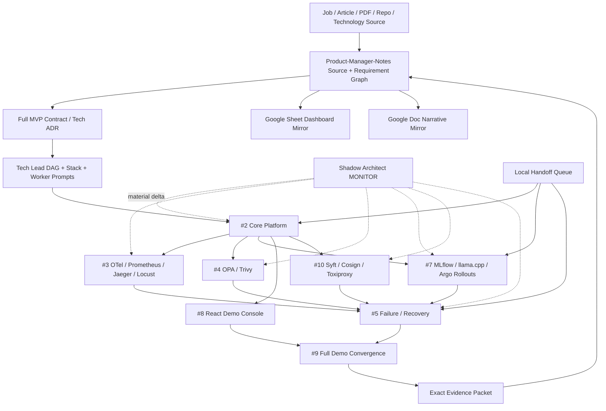

# DevOps Manager Notes

Public executable evidence plane for the **Full Manager MVP Demo**: one Internal AI Platform demo that covers the technical requirements of both the Technical Product Manager and DevOps Manager target roles.

`Product-Manager-Notes` is the private management/routing center. `skills-shared` owns reusable Tech Lead, Shadow Architect and Git Town methods. This repository owns public-safe implementation, CI/runtime evidence, failure/recovery exercises and exact receipts.

## Read first

```text
README.md
→ AGENTS.md
→ docs/INDEX.md
→ docs/architecture/FULL_MVP_DEMO.md
→ registry/mvp-demo-stack.yaml
→ registry/stack-plan.yaml
→ prompts/README.md
→ exact issue / PR / commit / Local Handoff subject
→ nearest implementation/test/receipt
```

## Eight-stage execution program

| Stage | Transition | Main result | Parallelism |
|---|---|---|---|
| P0 Subject / authority | `REQUEST_BOUND → SUBJECT_ADMITTED` | exact repo/branch/commit/issue, authority and evidence ceiling | serial |
| P1 Source / evidence | `SUBJECT_ADMITTED → CONTEXT_ADMITTED` | job/article/PDF/repo/technology evidence and gaps | parallel source workers |
| P2 Problem closure / System Design | `CONTEXT_ADMITTED → SYSTEM_CONTRACT_EXTRACTED` | invariants, state machines, failure matrix, product/system contract | Product + DevOps design lanes |
| P3 Technology / ADR | `SYSTEM_CONTRACT_EXTRACTED → ARCHITECTURE_ADMITTED` | commercially usable stack, rejected alternatives, license boundaries | candidate families in parallel |
| P4 Tech Lead DAG / Stack | `ARCHITECTURE_ADMITTED → WORKERS_ADMITTED` | start/completion DAG, leases, molecular Stack, Worker packets | bounded compilation |
| P5 Implementation fan-out | `WORKERS_ADMITTED → FIRST_GREEN` | core plus path-disjoint terminal leaves | #3/#4/#7/#8/#10 after #2 |
| P6 Runtime / failure proof | `FIRST_GREEN → REVERIFIED` | load/fault/canary/rollback/postmortem/same-failure re-test receipts | selected runtime probes |
| P7 Convergence / export / handoff | `REVERIFIED → DEMO_EVIDENCE_READY` | one-command reviewer path, indexes, public evidence packet, Local Handoff residuals | one convergence owner |

`FIRST_GREEN` is a mandatory Shadow Architect checkpoint, not completion.

## End-to-end state machine

```text
SOURCE_BOUND
→ BUILD_TESTED
→ SBOM_CREATED
→ SECURITY_POLICY_ADMITTED
→ ARTIFACT_SIGNED
→ MODEL_CONFIG_REGISTERED
→ OFFLINE_EVAL_RUNNING
    ├── EVAL_REJECTED
    └── PROMOTION_ELIGIBLE
→ GITOPS_DESIRED_STATE_BOUND
→ CANARY_RUNNING
    ├── CANARY_REJECTED → ROLLBACK_RUNNING
    └── PROMOTED
→ OBSERVED
→ LOAD_OR_FAULT_PROBE_RUNNING
→ HEALTHY | DEGRADED
→ MITIGATING
→ RECOVERED
→ POSTMORTEM_OPEN
→ CORRECTIVE_CHANGE_BOUND
→ SAME_FAILURE_RETEST
→ REVERIFIED
→ DEMO_EVIDENCE_READY
```

Illegal promotion examples:

```text
CI_GREEN        → BUSINESS_CORRECT                 forbidden
LOCAL_K8S_PASS  → PRODUCTION_INFRA_EXPERIENCE      forbidden
1000_VU_PASS    → 1000_REAL_USERS                  forbidden
DRILL_COMPLETE  → PRODUCTION_INCIDENT_HISTORY      forbidden
MODEL_LICENSE   → ALL_TRANSITIVES_CLEARED          forbidden
UI_GREEN        → BACKEND_EVIDENCE_PASS            forbidden
ISSUE_CLOSED    → RUNTIME_CLOSED                   forbidden
```

## Repository topology

```text
DevOps-Manager-Notes/
├── README.md
├── AGENTS.md
├── LICENSE
├── docs/
│   ├── INDEX.md
│   └── architecture/
│       ├── DELIVERY_RELIABILITY_LAB.md
│       └── FULL_MVP_DEMO.md
├── roles/devops-manager/
│   └── job-contract.yaml
├── registry/
│   ├── evidence.yaml
│   ├── gaps.yaml
│   ├── technology-candidates.yaml
│   ├── mvp-demo-stack.yaml
│   └── stack-plan.yaml
├── prompts/
│   ├── README.md
│   ├── issue-2-core-platform.md
│   ├── issue-3-observability-load.md
│   ├── issue-4-policy-security.md
│   ├── issue-7-llmops-progressive-delivery.md
│   ├── issue-8-demo-console.md
│   ├── issue-10-supply-chain-fault.md
│   ├── issue-5-failure-recovery.md
│   └── issue-9-final-convergence.md
├── system-design/
├── sre/
├── platform/
│   ├── app/
│   ├── docker/
│   ├── kubernetes/
│   ├── gitops/
│   ├── rollouts/
│   └── policies/
├── mlops/
│   ├── eval/
│   ├── registry/
│   ├── prompts/
│   ├── models/
│   └── adapters/
├── demo-console/
│   └── src/
├── observability/
├── supply-chain/
├── tests/
│   ├── unit/
│   ├── integration/
│   ├── e2e/
│   ├── load/
│   └── failure/
├── incidents/
├── runbooks/
├── management/
├── scripts/
│   ├── demo/
│   └── handoff/
├── handoff/
│   └── local-handoff-queue.json
├── evidence/receipts/
│   ├── base/
│   ├── observability/
│   ├── security/
│   ├── llmops/
│   ├── supply-chain/
│   ├── failure/
│   └── convergence/
└── .github/workflows/
```

Directories are created only when their first real artifact lands. Path presence is not capability proof.

## Directory → State Machine → DAG ownership

| Surface | State responsibility | Owner issue | Output / evidence ceiling |
|---|---|---:|---|
| `registry/mvp-demo-stack.yaml` | technology candidate → selected/rejected → remaining proof | #11 / PR #12 | design/source verification only |
| `system-design/` | requirement → invariant/SLO/failure contract | #1 | design/static reasoning |
| `platform/app/` | request/business state → deterministic oracle | #2 | L2 before integration |
| `platform/docker/` | source → immutable container digest | #2 | L2-L3 |
| `platform/kubernetes/` + `platform/gitops/` | desired → observed deployment / reconciliation | #2 | named local substrate only |
| `observability/` + `sre/` | request → trace/metrics/SLI/SLO/load evidence | #3 | named environment / synthetic workload |
| `platform/policies/` | artifact/deployment → admit/reject | #4 | policy/security lane only |
| `mlops/` + `platform/rollouts/` | model/prompt/config → eval → canary → rollback | #7 | exact local/model/canary lane |
| `demo-console/` | typed evidence API → reviewer UI | #8 | presentation only; cannot promote evidence |
| `supply-chain/` | exact artifact → SBOM/scan/signature/fault tooling | #10 | exact artifact/fault lane |
| `incidents/` + `runbooks/` + `management/` | failure → decision → recovery → corrective action | #5 | DRILL unless real production event |
| `registry/stack-plan.yaml` | issue → atom → branch relation → lease | Tech Lead | planning/publication only |
| `prompts/` | frozen contract → zero-context Worker packet | Tech Lead | instruction only |
| `handoff/local-handoff-queue.json` | remote boundary → local command → receipt | #2 then later runtime owners | queue shape until executed |
| `evidence/receipts/` | exact subject/env/workload → verdict | lane owners | exact named evidence lane |
| `scripts/demo/` + final indexes | admitted receipts → reviewer path | #9 | convergence only |

## Full data flow



## Start-readiness DAG

```text
PR #6 bootstrap contract
  └─ PR #12 / #11 Full MVP technology + architecture contract
       └─ #1 invariant/evidence audit
            └─ #2 core platform contract
                 ├─ #3 observability/load
                 ├─ #4 policy/security/license
                 ├─ #7 ML/LLMOps/progressive delivery
                 ├─ #8 Demo Console
                 └─ #10 supply-chain/fault tooling

#5 failure-scenario design may start after #2 exposes failure surfaces.
#9 convergence design may start before all leaves close, but cannot complete early.
```

## Completion-readiness DAG

```text
#11 / PR #12 technology contract
→ #1 exact invariant/evidence audit
→ #2 exact base delivery receipt
→ (#3 AND #4 AND #7 AND #10 exact lane receipts)
→ #5 failure/rollback/postmortem/same-failure receipt
→ (#5 AND #8 exact receipts)
→ #9 Full Manager MVP convergence receipt
```

## Molecular Git Town Stack

`registry/stack-plan.yaml` is canonical. Planned structure:

```text
C0   PR #6    bootstrap DevOps contract                  ROOT
└─ C11 PR #12  Full MVP technology/architecture          TRUE_CHILD
   └─ E1  #1   invariant/evidence audit                  TRUE_CHILD while parent bytes unmerged
      └─ K2 #2 core app/CI/container/K8s                 TRUE_CHILD
         ├─ A3  #3 observability/load                    SIBLING
         ├─ E4  #4 policy/security/license               SIBLING
         ├─ A7  #7 ML/LLMOps/progressive delivery        SIBLING
         ├─ A8  #8 Demo Console                          SIBLING
         └─ E10 #10 SBOM/signing/fault tooling           SIBLING
              └──── verified side-input receipts ───┐
                                                   ▼
         X5  #5 failure/recovery/postmortem          CONVERGENCE
              └────────────┬─────────────────────────┘
                           ▼
         X9  #9 final reviewer demo                  CONVERGENCE
```

A sibling becomes a true child only if it actually consumes another sibling's **unmerged bytes/contracts**. Multi-input convergence does not fabricate multiple Git parents.

## Separate ChatGPT Worker sessions

After #2 freezes the typed service/artifact contracts, Tech Lead can open separate zero-context sessions using `prompts/`:

| Session | Issue | Path lease | May run in parallel? |
|---|---:|---|---|
| Core | #2 | app/docker/k8s/gitops/base tests/workflows | no; establishes shared contract |
| Observability | #3 | observability/sre/load receipts | yes |
| Policy/Security | #4 | policies/security receipts | yes |
| ML/LLMOps | #7 | mlops/rollouts/llmops receipts | yes |
| Demo Console | #8 | demo-console/UI tests | yes |
| Supply chain/fault | #10 | supply-chain/fault-tool receipts | yes |
| Failure convergence | #5 | incidents/runbooks/management/failure receipts | after prerequisite receipts |
| Final convergence | #9 | README/index/demo orchestrator/convergence receipt | one owner only |

Every session receives an exact subject, start/completion dependencies, allowed/read-only/forbidden paths, consumed/provided artifacts, evidence ceiling, Shadow watch list and Local Handoff boundary.

## Selected MVP stack

The complete machine-readable inventory is `registry/mvp-demo-stack.yaml`. Required deterministic path includes:

```text
Python / FastAPI / Pydantic
PostgreSQL / SQLAlchemy / Alembic
React / Vite / TanStack Query / Apache ECharts
MLflow / llama.cpp / pinned permissive small model artifact
Docker CLI / Moby / Colima-or-Rancher-Desktop
kind / Kubernetes / Argo CD / Argo Rollouts
OpenTelemetry Collector / Prometheus / Jaeger
OPA / Trivy / Syft / Cosign
Locust / Toxiproxy / pytest
GitHub Actions
```

The default distribution policy prefers MIT, Apache-2.0, BSD and PostgreSQL-style permissive terms. Top-level licensing never recursively clears transitive packages, container images, plugins, model weights, downloaded binaries, GitHub Actions or SaaS terms. vLLM/KServe remain future production-shaped adapters, not core-demo blockers.

## Repository integrations

```text
skills-shared
  agentic-tech-lead-orchestration
  spatial-loop-systems-engineering
  git-town-stacked-pr-worker
       ↓ reusable method only
DevOps-Manager-Notes
       ↓ trigger-selected support
runtime-env               secret-free local/provider runtime contract
truth-verify-loop         mutable/high-risk external claim verification
openwiki-source-anchoring exact source/path/quote verification for generated docs
skill-resume-site         P7 public portfolio projection only after evidence admission
```

Support repositories never own this consumer's issue/branch/runtime state and cannot widen evidence or merge authority.

## Google / GitHub boundary

GitHub is canonical for requirements routed here, issues, PRs, commits, Stack state and evidence receipts. The Product control plane mirrors approved state to the existing Google Sheet dashboard and Google Doc narrative index. A Google URL proves reachability only and never promotes evidence.

## Automation boundary

Automation is expected for source/claim routing, task compilation, code generation, tests, CI, SBOM/scans/policy checks, receipt aggregation, dashboard sync and repeatable local probes. The following remain outside unattended Worker authority:

```text
semantic conflict resolution
force push / merge / release
repository visibility or permission widening
production promotion / production rollback admission
credential or provider enrollment decisions
claims of real users, real incidents, production tenure or people-management tenure
```

## Local Handoff Execution Queue

Physical Docker/kind/Kubernetes/model/fault claims require a real admitted host. `handoff/local-handoff-queue.json` contains only concrete, bounded commands already present in the exact execution subject. Future runtime items are compiled only after their executable runner exists; placeholders do not become commands.

Queue shape validation is not execution. A local PASS receipt remains bounded to its exact evidence ceiling.

## Current Shadow Architect closure

```text
bootstrap contract                PASS_AS_DESIGN        PR #6
Full MVP technology contract      PASS_AS_DESIGN        PR #12 / #11
exact invariant/evidence audit    NOT_EXERCISED          #1
core platform                     NOT_IMPLEMENTED        #2
observability/load                NOT_IMPLEMENTED        #3
policy/security                   NOT_IMPLEMENTED        #4
ML/LLMOps/progressive delivery    NOT_IMPLEMENTED        #7
Demo Console                      NOT_IMPLEMENTED        #8
supply-chain/fault tooling        NOT_IMPLEMENTED        #10
failure/recovery                  NOT_IMPLEMENTED        #5
full reviewer convergence         NOT_IMPLEMENTED        #9
local capability execution        NOT_EXERCISED          Local Handoff
production/management tenure      OUTSIDE_REPO_PROOF     Human evidence only
```

The next legal frontier is #1, followed by #2. After #2 freezes shared interfaces, #3/#4/#7/#8/#10 are the primary parallel Worker fan-out.
