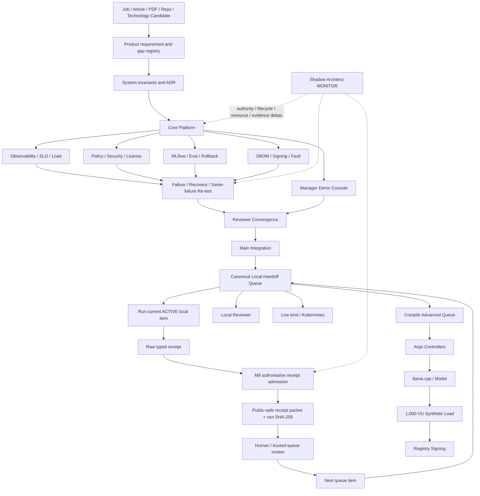

# DevOps Manager Notes

Public executable evidence plane for the **Full Manager MVP Demo**: an Internal AI Platform portfolio proving bounded Technical Product Manager and DevOps Manager capabilities through exact Git subjects, deterministic failure oracles, reviewer evidence, typed Local Handoff receipts and public-safe receipt admission.

## Authority and control planes

```text
ed3c/skills-shared
  canonical Tech Lead / Shadow Architect / Git Town / Local Handoff method
        ↓
ed3c/Product-Manager-Notes
  job requirements / product decisions / gaps / interview narrative routing
        ↓ exact public-safe evidence request
ed3c/DevOps-Manager-Notes
  code / CI / runtime contracts / failure drills / receipts / Demo Console
        ↓ exact admitted public-safe evidence projection
Product-Manager-Notes + Google projections
  interview and dashboard views; never evidence authority
```

GitHub is canonical. Google Doc, Google Sheet, issue prose and UI views are projections only.

## Current checkpoints

```text
M1 CORE_REMOTE_FIRST_GREEN                          PASS_BOUNDED
M2 PUBLIC_REMOTE_FANOUT_FIRST_GREEN                 PASS_BOUNDED
M3 PUBLIC_REMOTE_FAILURE_RECOVERY_FIRST_GREEN       PASS_BOUNDED
M4 PUBLIC_REMOTE_REVIEWER_CONVERGENCE_FIRST_GREEN   PASS_BOUNDED
M5 PUBLIC_LOCAL_KIND_RUNNER_AND_QUEUE_READY          PASS_BOUNDED
M6 PUBLIC_ADVANCED_RUNNER_CONTRACTS_READY            PASS_BOUNDED
M7 PUBLIC_ADVANCED_EXECUTION_BUNDLE_READY             PASS_BOUNDED
M8 PUBLIC_MAIN_INTEGRATION_AND_HANDOFF_READY           PASS_BOUNDED
M9 PUBLIC_LOCAL_RECEIPT_ADMISSION_READY                PASS_BOUNDED
```

M9 adds a bounded admission boundary between raw local typed receipts and any public GitHub projection. It does **not** execute local reviewer, kind/Kubernetes, Argo, model, 1,000-VU or registry signing; it does not advance the queue; and it does not raise any runtime evidence ceiling.

### Current M9 implementation subject

```text
A9 implementation PR #77
branch  feat/m9-local-receipt-admission
head    fc7ae40c0a5ea0a403c2ed27555de3cbbc8d042b
tree    67acc95ed6ee85091dfe30c8b853bc54203c3cda
run     32376416583  SUCCESS
ceiling GITHUB_HOSTED_M9_RECEIPT_ADMISSION_CONTRACT_ONLY
```

The authoritative CLI is:

```text
scripts/handoff/admit_public_receipt_packet.py
```

`scripts/handoff/compile_public_receipt_packet.py` is the bounded parsing/projection core library; Agents must not bypass the authoritative admission wrapper when converting real Local Handoff receipts into public evidence.

## Current proof frontier

```text
repository integration                              PASS_BOUNDED
Core API/PostgreSQL/Alembic/Docker CI               PASS_BOUNDED
observability/business oracle/20-VU smoke           PASS_BOUNDED
policy/security/license metadata                    PASS_BOUNDED
MLflow lifecycle/eval/rejection/rollback            PASS_BOUNDED
Demo Console build                                  PASS_BOUNDED
SBOM/same-run signing/bounded fault drill           PASS_BOUNDED
seven failure/recovery/re-test drills               PASS_BOUNDED
reviewer packet and artifact re-verification        PASS_BOUNDED
runner and queue compiler contracts                 PASS_BOUNDED
public-safe local receipt admission contract        PASS_BOUNDED

local deterministic reviewer                        NOT_EXERCISED
live kind/Kubernetes application smoke              NOT_EXERCISED
live advanced queue compilation                     NOT_EXERCISED
Argo controllers                                    NOT_EXERCISED
Argo CD Application reconciliation                  NOT_EXERCISED
live Argo Rollouts/Prometheus canary                NOT_EXERCISED
llama.cpp + exact model inference                   NOT_EXERCISED
synthetic 1,000-VU execution                        NOT_EXERCISED
registry-stored image signing                       NOT_EXERCISED
production users/incidents/tenure                   OUTSIDE_CURRENT_PROOF
people-management tenure                            OUTSIDE_REPOSITORY_PROOF
```

## Read order

```text
README.md
→ AGENTS.md
→ docs/INDEX.md
→ docs/architecture/FULL_MVP_DEMO.md
→ docs/milestones/PUBLIC_M9_LOCAL_RECEIPT_ADMISSION_READY.md
→ registry/public-m9-local-receipt-admission.json
→ registry/stack-plan.yaml
→ handoff/local-handoff-queue.json
→ exact issue / PR / commit / Actions run / artifact / raw receipt / public packet
```

Historical M2–M8 milestones and machine registries remain reachable through `docs/INDEX.md`.

## End-to-end State Machine

```text
SOURCE_BOUND
→ REQUIREMENT_CLASSIFIED
→ SYSTEM_CONTRACT_FROZEN
→ TECHNOLOGY_ADMITTED
→ WORKERS_ADMITTED
→ BUILD_TESTED
→ SBOM_CREATED
→ SECURITY_POLICY_ADMITTED
→ MODEL_CONFIG_REGISTERED
→ OFFLINE_EVAL_RUNNING
    ├─ EVAL_REJECTED
    └─ PROMOTION_ELIGIBLE
→ GITOPS_DESIRED_STATE_BOUND
→ CANARY_CONTRACT_READY
→ OBSERVED
→ LOAD_OR_FAULT_PROBE_RUNNING
→ HEALTHY | DEGRADED
→ INCIDENT_COMMAND_ACTIVE
→ MITIGATING
→ RECOVERED
→ POSTMORTEM_OPEN
→ CORRECTIVE_CHANGE_BOUND
→ SAME_FAILURE_RETEST
→ REVERIFIED
→ REVIEWER_PACKET_ASSEMBLED
→ REMOTE_DEMO_EVIDENCE_READY
→ MAIN_INTEGRATED
→ LOCAL_HANDOFF_READY
→ LOCAL_REVIEWER_ACTIVE
    ├─ FAIL → LOCAL_GAP_OPEN
    └─ PASS → RAW_LOCAL_RECEIPT_READY
→ LOCAL_RECEIPT_ADMISSION
    ├─ stale / wrong subject / secret / wrong ceiling / blocked-future receipt → ADMISSION_REJECTED
    └─ admitted PASS receipt → HUMAN_QUEUE_ADVANCE_REQUIRED
→ LIVE_KIND_RUNNING
    ├─ FAIL → LOCAL_GAP_OPEN
    └─ PASS → RAW_LOCAL_RECEIPT_READY
→ LOCAL_RECEIPT_ADMISSION
    └─ admitted PASS receipt → ADVANCED_QUEUE_COMPILATION_UNBLOCKED
→ ADVANCED_QUEUE_COMPILING
    ├─ invalid predecessor receipt → LOCAL_GAP_OPEN
    └─ PASS → RAW_LOCAL_RECEIPT_READY
→ LOCAL_RECEIPT_ADMISSION
    └─ admitted compile receipt → ADVANCED_QUEUE_REVIEW_REQUIRED
→ ARGO_CONTROLLERS
→ LOCAL_MODEL
→ SYNTHETIC_1000_VU
→ REGISTRY_SIGNING
→ LOCAL_ADVANCED_EVIDENCE_READY
```

States after `LOCAL_HANDOFF_READY` remain physical/local states until their own receipts exist. `LOCAL_RECEIPT_ADMISSION` validates and projects an existing receipt; it never causes the underlying runtime transition.

## Directory → State Machine → DAG ownership

| Directory | State / transition owned | Implementation owner | Evidence ceiling |
|---|---|---|---|
| `platform/app/` | `BUILD_TESTED → BUSINESS_ORACLE_EVALUATED` | Core PR #14, integrated by #68 | hosted deterministic Core |
| `platform/docker/` | source → immutable image subject | Core / supply-chain | hosted image identity |
| `platform/kubernetes/` | desired deployment → readiness contract | Core + live-kind runner | contract only until local receipt |
| `platform/gitops/` | desired state binding | architecture/Core | desired-state contract |
| `platform/rollouts/` | eval eligible → canary contract / rollback target | PR #39 | deterministic desired-state contract |
| `platform/policies/` | candidate → admitted/rejected | PR #38 | hosted policy/security metadata |
| `mlops/` | register → evaluate → promote/reject → rollback | PR #39 | hosted MLflow lifecycle only |
| `observability/` | request → metric/trace/business signal | PR #36 | hosted telemetry and bounded load |
| `sre/` | SLI → SLO decision | PR #36 | synthetic/hosted evidence |
| `supply-chain/` | image → SBOM → sign/verify → tamper reject | PR #40 | same-run hosted blob evidence |
| `tests/failure/scenarios/` | trigger → detect → mitigate → recover → re-test | PR #42 | DRILL/SIMULATION only |
| `demo-console/` | canonical evidence → reviewer UI | PR #37 | rendering only |
| `scripts/demo/` | exact remote receipts → reviewer packet | PR #44 | deterministic reviewer evidence |
| `scripts/handoff/run_*` | local command → raw typed receipt | PR #51/#55–#58 | only after real local execution |
| `scripts/handoff/compile_m7_advanced_queue.py` | predecessor receipts → candidate advanced queue | PR #65 | queue compilation only |
| `scripts/handoff/compile_public_receipt_packet.py` | typed receipt parsing → allowlisted projection core | A9 PR #77 | compiler library only |
| `scripts/handoff/admit_public_receipt_packet.py` | current queue + raw receipt → admitted public-safe packet | A9 PR #77 | hosted admission contract; live packet remains projection |
| `handoff/` | exactly one ACTIVE item → receipt-gated successor | M8 queue / trusted controller | queue existence is not execution |
| `evidence/local-handoff/` | admitted packet output | M9 admission | public-safe projection only |
| `docs/milestones/` | evidence subject → bounded narrative | Tech Lead traceability owner | documentation only |
| `registry/` | exact subject / DAG / gap / evidence index | Tech Lead convergence owner | machine routing only |
| `incidents/` / `runbooks/` / `management/` | drill authority / recovery communication | PR #42 | simulated Manager process evidence |

## Task DAG and evidence data flow



The admission loop is deliberately separate from execution: receipt projection cannot mutate queue state and cannot satisfy the trusted `queue_advance` authority transition by itself.

## Molecular Git Town / Stack PR index

### Historical implementation topology

```text
PR #6 bootstrap
└─ PR #12 Full MVP architecture
   └─ PR #13 invariant/evidence audit
      └─ PR #14 Core
         ├─ PR #36 Observability
         ├─ PR #37 Demo Console
         ├─ PR #38 Policy/Security
         ├─ PR #39 ML/LLMOps
         └─ PR #40 Supply/Fault

PR #36
└─ PR #42 Failure/Recovery
   └─ PR #44 Reviewer Convergence
      └─ PR #45 Local Handoff bootstrap
         └─ PR #51 Live-kind runner
            └─ PR #52 Canonical Local Handoff
               └─ PR #65 Advanced bundle/compiler

Task-sibling runner leaves:
PR #39 → PR #55 Argo
PR #39 → PR #56 Model
PR #36 → PR #57 Capacity
PR #40 → PR #58 Registry Signing
```

### Main integration and M9 topology

```text
X8 PR #68 backbone                           → main
A8 PR #37 Demo Console                       → main
E8 PR #38 Policy/Security                    → main
A8 PR #39 ML/LLMOps                          → main
E8 PR #40 Supply/Fault                       → main
X8 PR #69 advanced runner tests/workflows    → main
D8 PR #70/#71 M8 routing/traceability        → main

main
└─ A9 PR #77 Public receipt admission
   └─ D9 M9 traceability child
```

PR #55–#58 are historical exact subjects whose runtime bytes and tests reached `main` through convergence. They are not replay-merged merely to make the graph look linear.

## M9 receipt admission contract

The public repository must never copy arbitrary local receipt content into a PR. The M9 guard applies four boundaries before projection:

```text
1. queue authority
   canonical schema + exact subject + COMPLETE* → ACTIVE → BLOCKED* shape

2. receipt identity
   exact schema + repository + commit + tree + verdict + evidence ceiling + cleanup

3. public disclosure
   byte bounds + admitted roots + secret/sensitive-key rejection + allowlisted summaries

4. mutation authority
   output cannot overwrite queue/raw receipt; live packet stays under evidence/local-handoff;
   blocked future receipts are rejected; queue is never advanced
```

Typical local projection after the current ACTIVE item has emitted a receipt:

```bash
python3 scripts/handoff/admit_public_receipt_packet.py \
  --queue handoff/local-handoff-queue.json \
  --receipt-root evidence/local-reviewer \
  --receipt M8-LOCAL-REVIEWER-001=handoff-receipt.json \
  --output evidence/local-handoff/public-receipt-packet.json
```

The packet records the raw receipt path relative to the admitted root, SHA-256 and byte count, but does not copy arbitrary logs/output tails. A `PASS` packet may return `HUMAN_QUEUE_ADVANCE_REQUIRED`; it is not permission for unattended advancement.

## Local Handoff Execution Queue

Canonical queue: `handoff/local-handoff-queue.json`.

Execution subject:

```text
commit   e7b4e23799a3579572598ebd5864a80831d49db4
tree     0b72b9f09f73d3829db2f138d457a5691641bf79
rollback bb940bf7d5a3b1f605b79e9fb8f33c463a8ee5a7
```

Current order:

```text
M8-LOCAL-REVIEWER-001             ACTIVE
  ↓ raw receipt → M9 admission → trusted review
M8-LIVE-KIND-002                  BLOCKED_BY_PREDECESSOR
  ↓ raw receipt → M9 admission → trusted review
M8-COMPILE-ADVANCED-QUEUE-003     BLOCKED_BY_PREDECESSOR
  ↓ compile receipt → M9 admission → portable queue assertion → trusted review
M7 advanced queue                 NOT_COMPILED
```

First local command remains:

```bash
python3 scripts/handoff/run_local_reviewer_handoff.py \
  --output evidence/local-reviewer/handoff-receipt.json \
  --work-dir evidence/local-reviewer/work
```

Do not execute the kind/compiler/advanced item before its predecessor receipt is reviewed and the queue is intentionally advanced by the trusted owner/controller.

## Residual issues

Stage-complete M9 contract work is owned by #76/#78 until this Stack reaches `main`. Physical residuals remain separate:

```text
#2   live kind/Kubernetes application acceptance
#3   real synthetic 1,000-VU execution
#7   exact model artifact/local inference/live canary
#9   final Local Handoff and advanced runtime convergence
#67  repository-admin deletion of orchestration-only temporary branches
#76  M9 receipt-admission stage until main merge
#78  M9 traceability child until main merge
```

Issue state is routing metadata, never capability evidence.

## Forbidden promotions

```text
CI_GREEN                    → BUSINESS_CORRECT                 forbidden
RUNNER_CONTRACT_PASS        → PHYSICAL_RUNTIME_PASS            forbidden
QUEUE_EXISTS                → QUEUE_EXECUTED                   forbidden
FIXTURE_PASS                → LIVE_PREDECESSOR_PASS            forbidden
RECEIPT_PACKET_EXISTS       → RAW_RUNTIME_REEXECUTED           forbidden
PUBLIC_PACKET_PASS          → QUEUE_ADVANCED                   forbidden
BLOCKED_RECEIPT_PRESENT     → BLOCKED_ITEM_COMPLETED           forbidden
LOCAL_K8S_PASS              → PRODUCTION_INFRA_EXPERIENCE      forbidden
ARGO_CONTROLLERS_PASS       → APPLICATION_RECONCILIATION_PASS  forbidden
LOCAL_MODEL_PASS            → PRODUCTION_LLM_TRAFFIC           forbidden
1000_VU_PASS                → 1000_REAL_USERS                  forbidden
LOCAL_SIGNING_PASS          → PRODUCTION_KEY_CUSTODY           forbidden
DRILL_COMPLETE              → PRODUCTION_INCIDENT_HISTORY      forbidden
LICENSE_METADATA_PASS       → BLANKET_LEGAL_CLEARANCE          forbidden
REPOSITORY_ARTIFACT         → EMPLOYMENT_OR_MANAGER_TENURE     forbidden
```

Merge, release, visibility, permission changes, production promotion/rollback, provider credentials, queue advancement and real-experience claims remain Human/trusted-owner decisions.
